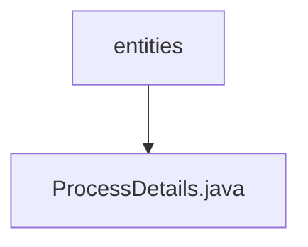

# 基础信息

|      |      |
|------|------|
| 名称 | entities |
| 编码语言 | .java |
| 代码路径 | Java/src/main/java/com/thealgorithms/devutils/entities |
| 包名 | Java.src.main.java.com.thealgorithms.devutils.entities |
| 概述说明 | ProcessDetails类包含进程ID、到达时间、执行时间、等待时间、周转时间和优先级。 |

# 说明

ProcessDetails类用于描述进程的详细信息，包含多个关键属性。进程ID用于唯一标识每个进程。到达时间记录进程进入系统的时间点。执行时间表示进程完成所需的时间长度。等待时间反映进程在系统中等待执行的时间。周转时间是从进程到达系统到完成的总时间。优先级用于确定进程的执行顺序，优先级高的进程优先执行。这些属性共同提供了进程在系统中的全面信息，便于管理和调度。

### 包内部结构视图

流程图描述：该流程图展示了路径的层级关系，`entities`文件夹下包含一个名为`ProcessDetails.java`的文件。这种结构清晰地表示了文件在项目中的位置，便于开发者快速定位和管理相关代码文件。

# 文件列表 File List

| 名称   | 类型  | 说明 |
|-------|------|-------------|
| [ProcessDetails.java](ProcessDetails.md) | file | ProcessDetails类包含进程ID、到达时间、执行时间、等待时间、周转时间和优先级。 |

