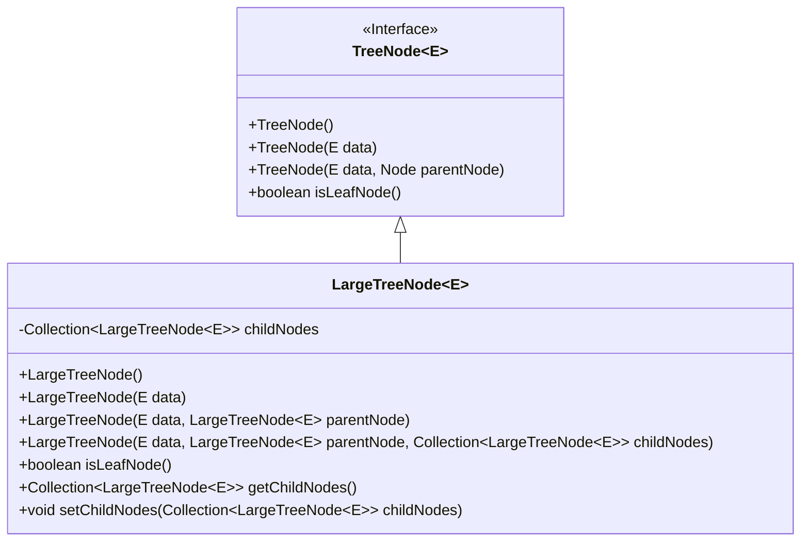
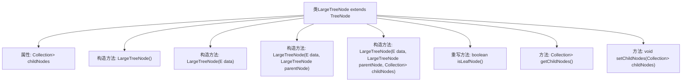

# 基础信息

|      |      |
|------|------|
| 名称 | LargeTreeNode |
| 编码语言 | .java |
| 代码路径 | Java/src/main/java/com/thealgorithms/devutils/nodes/LargeTreeNode.java |
| 包名 | com.thealgorithms.devutils.nodes |
| 依赖项 | ['java.util.Collection'] |
| 概述说明 | LargeTreeNode扩展TreeNode，支持数据、父节点和子节点初始化，提供子节点操作方法。 |

# 说明

LargeTreeNode类继承自TreeNode类，具备初始化数据、父节点和子节点的功能。该类提供了获取和设置子节点的方法，使其能够灵活管理节点间的层级关系。通过扩展TreeNode，LargeTreeNode增强了节点操作的便捷性和功能性，适用于需要复杂树结构处理的场景。

# 类列表 Class Summary

| 名称   | 类型  | 说明 |
|-------|------|-------------|
| LargeTreeNode | class | LargeTreeNode类扩展TreeNode，支持初始化数据、父节点和子节点，提供获取和设置子节点的方法。 |

## 类 LargeTreeNode

|      |      |
|------|------|
| 访问范围 | public |
| 类型 | class |
| 名称 | LargeTreeNode |
| 说明 | LargeTreeNode类扩展TreeNode，支持初始化数据、父节点和子节点，提供获取和设置子节点的方法。 |

### UML类图

这段代码定义了一个泛型类 `LargeTreeNode<E>`，它继承自 `TreeNode<E>`。`LargeTreeNode` 类包含一个 `Collection` 类型的私有成员 `childNodes`，用于存储子节点。该类提供了多个构造函数，用于初始化节点的数据、父节点和子节点。`isLeafNode` 方法用于判断当前节点是否为叶子节点，`getChildNodes` 和 `setChildNodes` 方法分别用于获取和设置子节点集合。`TreeNode` 是一个接口，`LargeTreeNode` 实现了该接口，并扩展了其功能。

### 内部方法调用关系图

这段代码定义了一个名为 `LargeTreeNode<E>` 的类，它继承自 `TreeNode<E>`。该类包含一个用于存储子节点的 `Collection` 属性 `childNodes`，并提供了多个构造方法用于初始化节点的数据和父子节点关系。此外，该类重写了 `isLeafNode()` 方法以判断节点是否为叶子节点，并提供了 `getChildNodes()` 和 `setChildNodes()` 方法用于获取和设置子节点集合。

### 字段列表 Field List

| 名称  | 类型  | 说明 |
|-------|-------|------|
| childNodes | Collection<LargeTreeNode<E>> | 私有集合存储大型树节点子节点。 |

### 方法列表 Method List

| 名称  | 类型  | 说明 |
|-------|-------|------|
| getChildNodes | Collection<LargeTreeNode<E>> | 获取子节点集合的方法。 |
| setChildNodes | void | 设置LargeTreeNode的子节点集合。 |
| isLeafNode | boolean | 该方法判断节点是否为叶节点，即无子节点。 |

