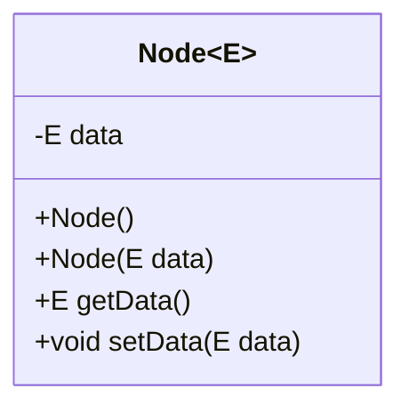
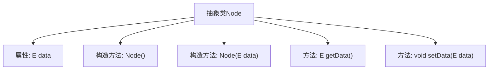

# 基础信息

|      |      |
|------|------|
| 名称 | Node |
| 编码语言 | .java |
| 代码路径 | Java/src/main/java/com/thealgorithms/devutils/nodes/Node.java |
| 包名 | com.thealgorithms.devutils.nodes |
| 依赖项 | [] |
| 概述说明 | 抽象类Node存储泛型数据，提供构造器和数据访问方法。 |

# 说明

抽象类Node用于存储泛型数据，具备构造器以便初始化对象，并提供数据访问方法，允许外部代码获取或操作存储的数据。该类通过泛型设计，支持多种数据类型，增强了代码的灵活性和复用性。

# 类列表 Class Summary

| 名称   | 类型  | 说明 |
|-------|------|-------------|
| Node | class | 抽象类Node存储泛型数据，提供构造器和数据访问方法。 |

## 类 Node

|      |      |
|------|------|
| 访问范围 | public abstract |
| 类型 | class |
| 名称 | Node |
| 说明 | 抽象类Node存储泛型数据，提供构造器和数据访问方法。 |

### UML类图

这段代码定义了一个泛型抽象类 `Node<E>`，用于存储泛型类型的数据 `data`。类中包含两个构造函数：一个无参构造函数和一个带参构造函数，用于初始化 `data`。此外，类还提供了 `getData` 和 `setData` 方法，分别用于获取和设置 `data` 的值。由于 `Node` 是抽象类，它不能被直接实例化，通常用于作为其他具体节点类的基类。

### 内部方法调用关系图

这段代码定义了一个抽象类 `Node<E>`，其中包含一个泛型类型的属性 `data`。类中提供了两个构造方法：一个无参构造方法和一个带参构造方法，用于初始化 `data`。此外，类中还提供了 `getData()` 和 `setData(E data)` 方法，分别用于获取和设置 `data` 的值。该类的设计允许子类继承并扩展其功能，同时确保数据的封装性和访问控制。

### 字段列表 Field List

| 名称  | 类型  | 说明 |
|-------|-------|------|
| data | E | 私有变量data存储类型E的数据。 |

### 方法列表 Method List

| 名称  | 类型  | 说明 |
|-------|-------|------|
| getData | E | 获取数据方法，返回存储的数据。 |
| setData | void | 设置类的数据属性为指定值。 |

