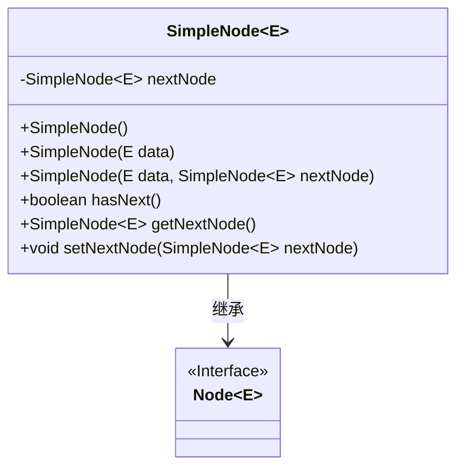
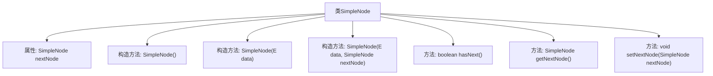

# 基础信息

|      |      |
|------|------|
| 名称 | SimpleNode |
| 编码语言 | .java |
| 代码路径 | Java/src/main/java/com/thealgorithms/devutils/nodes/SimpleNode.java |
| 包名 | com.thealgorithms.devutils.nodes |
| 依赖项 | [] |
| 概述说明 | SimpleNode继承Node，含数据及下节点引用，支持初始化、判断和操作下节点。 |

# 说明

SimpleNode类继承自Node类，主要用于表示节点的数据结构。它包含节点数据和对下一节点的引用，支持初始化操作，能够判断是否存在下一节点，并支持对下一节点进行操作。

# 类列表 Class Summary

| 名称   | 类型  | 说明 |
|-------|------|-------------|
| SimpleNode | class | SimpleNode类继承Node，包含节点数据和下一节点引用，支持初始化、判断和操作下一节点。 |

## 类 SimpleNode

|      |      |
|------|------|
| 访问范围 | public |
| 类型 | class |
| 名称 | SimpleNode |
| 说明 | SimpleNode类继承Node，包含节点数据和下一节点引用，支持初始化、判断和操作下一节点。 |

### UML类图

这段代码定义了一个泛型类 `SimpleNode<E>`，它继承自 `Node<E>` 接口。`SimpleNode` 类包含一个指向下一个节点的私有成员 `nextNode`，并提供了多个构造函数来初始化节点的数据和下一个节点的引用。此外，`SimpleNode` 类还提供了 `hasNext()` 方法来检查是否存在下一个节点，以及 `getNextNode()` 和 `setNextNode()` 方法来获取和设置下一个节点的引用。这个类主要用于实现链表数据结构中的节点操作。

### 内部方法调用关系图

这段代码定义了一个名为 `SimpleNode<E>` 的类，它继承自 `Node<E>` 类。`SimpleNode<E>` 类包含一个指向下一个节点的引用 `nextNode`，并提供了三个构造方法：一个无参构造方法、一个接受数据参数的构造方法，以及一个接受数据和下一个节点引用的构造方法。此外，该类还提供了 `hasNext()` 方法用于检查是否存在下一个节点，`getNextNode()` 方法用于获取下一个节点，以及 `setNextNode()` 方法用于设置下一个节点。这些方法共同构成了一个简单的链表节点结构。

### 字段列表 Field List

| 名称  | 类型  | 说明 |
|-------|-------|------|
| nextNode | SimpleNode<E> | 私有变量nextNode，类型为SimpleNode<E>。 |

### 方法列表 Method List

| 名称  | 类型  | 说明 |
|-------|-------|------|
| getNextNode | SimpleNode<E> | 获取当前节点的下一个节点。 |
| setNextNode | void | 设置当前节点的下一个节点为指定节点。 |
| hasNext | boolean | 检查是否有下一个节点。 |

