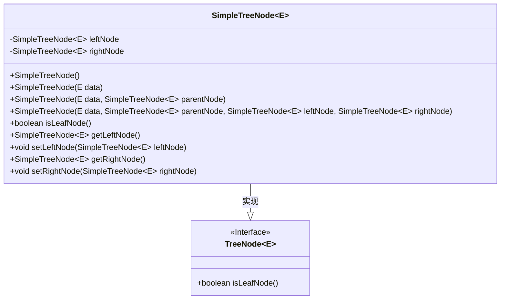
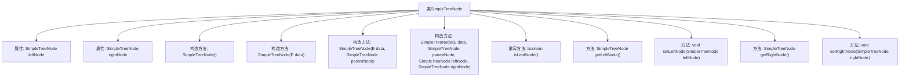

# 基础信息

|      |      |
|------|------|
| 名称 | SimpleTreeNode |
| 编码语言 | .java |
| 代码路径 | Java/src/main/java/com/thealgorithms/devutils/nodes/SimpleTreeNode.java |
| 包名 | com.thealgorithms.devutils.nodes |
| 依赖项 | [] |
| 概述说明 | SimpleTreeNode继承TreeNode，包含左右子节点引用及初始化方法。 |

# 说明

SimpleTreeNode类继承自TreeNode类，主要功能是扩展了树节点的结构，包含了指向左子节点和右子节点的引用。该类还提供了一个初始化方法，用于设置节点的初始状态和子节点引用，从而构建出更复杂的树形数据结构。

# 类列表 Class Summary

| 名称   | 类型  | 说明 |
|-------|------|-------------|
| SimpleTreeNode | class | SimpleTreeNode类扩展TreeNode，包含左右子节点引用和初始化方法。 |

## 类 SimpleTreeNode

|      |      |
|------|------|
| 访问范围 | public |
| 类型 | class |
| 名称 | SimpleTreeNode |
| 说明 | SimpleTreeNode类扩展TreeNode，包含左右子节点引用和初始化方法。 |

### UML类图

这段代码定义了一个 `SimpleTreeNode` 类，它继承自 `TreeNode` 接口。`SimpleTreeNode` 类表示一个二叉树节点，包含左右子节点的引用。该类提供了多个构造函数，允许初始化节点的数据、父节点以及左右子节点。`isLeafNode` 方法用于判断当前节点是否为叶子节点（即没有子节点）。通过 `getLeftNode` 和 `getRightNode` 方法可以获取左右子节点，而 `setLeftNode` 和 `setRightNode` 方法则用于设置左右子节点。

### 内部方法调用关系图

这段代码定义了一个泛型类 `SimpleTreeNode<E>`，它继承自 `TreeNode<E>`。该类包含了两个属性 `leftNode` 和 `rightNode`，分别表示左子节点和右子节点。类中提供了多个构造方法，用于初始化节点的数据和子节点引用。此外，还重写了 `isLeafNode()` 方法，用于判断节点是否为叶子节点，并提供了获取和设置左右子节点的方法。代码结构清晰，功能明确，适用于树形数据结构的实现。

### 字段列表 Field List

| 名称  | 类型  | 说明 |
|-------|-------|------|
| rightNode | SimpleTreeNode<E> | 私有简单树节点右子节点。 |
| leftNode | SimpleTreeNode<E> | 私有左子节点类型为SimpleTreeNode<E>。 |

### 方法列表 Method List

| 名称  | 类型  | 说明 |
|-------|-------|------|
| getRightNode | SimpleTreeNode<E> | 该方法返回当前节点的右子节点。 |
| getLeftNode | SimpleTreeNode<E> | 获取左子节点的方法。 |
| setLeftNode | void | 设置当前节点的左子节点为指定节点。 |
| isLeafNode | boolean | 判断节点是否为叶子节点，左右子节点为空时返回真。 |
| setRightNode | void | 设置当前节点的右子节点为指定节点。 |

