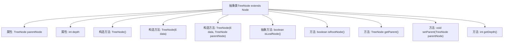

# 基础信息

|      |      |
|------|------|
| 名称 | TreeNode |
| 编码语言 | .java |
| 代码路径 | Java/src/main/java/com/thealgorithms/devutils/nodes/TreeNode.java |
| 包名 | com.thealgorithms.devutils.nodes |
| 依赖项 | [] |
| 概述说明 | 抽象类TreeNode继承Node，包含父节点引用、深度属性及相关方法。 |

# 说明

抽象类TreeNode继承自Node类，主要包含对父节点的引用、表示节点深度的属性以及与该节点相关的方法。该类通过扩展Node类，提供了更丰富的节点信息和管理功能，适用于需要处理层级结构或树形数据的场景。

# 类列表 Class Summary

| 名称   | 类型  | 说明 |
|-------|------|-------------|
| TreeNode | class | 抽象类TreeNode扩展Node，包含父节点引用、深度属性和相关方法。 |


## 类 TreeNode

|      |      |
|------|------|
| 访问范围 | public abstract |
| 类型 | class |
| 名称 | TreeNode |
| 说明 | 抽象类TreeNode扩展Node，包含父节点引用、深度属性和相关方法。 |


### UML类图

```mermaid
classDiagram
    class Node~E~ {
        <<abstract>>
        +Node()
        +Node(E data)
    }

    class TreeNode~E~ {
        <<abstract>>
        -TreeNode~E~ parentNode
        -int depth
        +TreeNode()
        +TreeNode(E data)
        +TreeNode(E data, TreeNode~E~ parentNode)
        +boolean isLeafNode()*
        +boolean isRootNode()
        +TreeNode~E~ getParent()
        +void setParent(TreeNode~E~ parentNode)
        +int getDepth()
    }

    Node~E~ <|-- TreeNode~E~ // 继承
```

类图描述：
`TreeNode` 是一个抽象类，继承自 `Node` 类，用于表示树结构中的节点。它包含一个指向父节点的引用 `parentNode` 和表示节点深度的 `depth` 属性。`TreeNode` 提供了判断节点是否为叶子节点或根节点的方法，以及获取和设置父节点、获取节点深度的方法。通过继承 `Node`，`TreeNode` 扩展了节点的基本功能，使其适用于树结构中的节点管理。


### 内部方法调用关系图



这段代码定义了一个抽象类 `TreeNode<E>`，它继承自 `Node<E>` 类。`TreeNode<E>` 类包含两个主要属性：`parentNode` 表示父节点的引用，`depth` 表示节点在树中的深度。类中提供了多个构造方法，用于初始化节点的数据和父节点引用。此外，类中还定义了一个抽象方法 `isLeafNode()`，用于判断节点是否为叶子节点，以及一些其他方法如 `isRootNode()`、`getParent()`、`setParent()` 和 `getDepth()`，分别用于判断节点是否为根节点、获取父节点、设置父节点和获取节点的深度。

### 字段列表 Field List

| 名称  | 类型  | 说明 |
|-------|-------|------|
| depth | int | 定义一个私有整型变量depth。 |
| parentNode | TreeNode<E> | 私有属性，表示树节点的父节点。 |

### 方法列表 Method List

| 名称  | 类型  | 说明 |
|-------|-------|------|
| getDepth | int | 该方法返回深度值。 |
| setParent | void | 设置父节点并更新深度。 |
| getParent | TreeNode<E> | 获取当前节点的父节点。 |
| isRootNode | boolean | 判断当前节点是否为根节点，条件是父节点为空。 |
| isLeafNode | boolean | 判断节点是否为叶子节点的方法。 |


