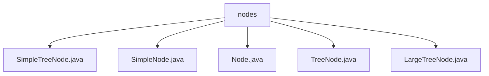

# 基础信息

|      |      |
|------|------|
| 名称 | nodes |
| 编码语言 | .java |
| 代码路径 | Java/src/main/java/com/thealgorithms/devutils/nodes |
| 包名 | Java.src.main.java.com.thealgorithms.devutils.nodes |
| 概述说明 | 多个Java类扩展Node类，支持树形和链表数据结构，提供初始化、数据访问和节点管理功能。 |

# 说明

## 概述
该代码模块主要围绕树形数据结构的节点管理展开，提供了多个节点类来支持不同复杂度的树形数据处理需求。模块的核心是`Node`抽象类，它作为所有节点类的基类，提供了泛型数据存储和基本操作功能。`TreeNode`类继承自`Node`，进一步扩展了节点的层级信息管理能力。在此基础上，`SimpleTreeNode`、`LargeTreeNode`等类分别针对不同的业务场景进行了功能扩展，支持更复杂的树形结构操作。整体设计注重灵活性和复用性，适用于需要处理层级结构或树形数据的应用场景。

## 主要业务场景
1. **简单链表节点管理**：`SimpleNode`类用于表示链表节点，支持节点数据的存储和下一节点的引用操作，适用于简单的链表数据结构管理。
2. **基础树节点管理**：`TreeNode`类提供了基础的树节点功能，包括父节点引用和节点深度信息，适用于需要处理层级结构的场景。
3. **简单树节点扩展**：`SimpleTreeNode`类在`TreeNode`的基础上扩展了左子节点和右子节点的引用，适用于二叉树的构建和操作。
4. **复杂树节点管理**：`LargeTreeNode`类进一步增强了节点的管理功能，支持多子节点的操作，适用于需要处理复杂树形结构的场景，如多叉树或森林结构。
5. **泛型数据支持**：所有节点类均基于`Node`抽象类的泛型设计，支持多种数据类型的存储和操作，增强了代码的灵活性和复用性。

### 包内部结构视图

该流程图展示了路径层级关系，所有节点文件均位于`nodes`文件夹下。这些文件包括`SimpleTreeNode.java`、`SimpleNode.java`、`Node.java`、`TreeNode.java`和`LargeTreeNode.java`，它们共同构成了`nodes`目录的内容结构。

# 文件列表 File List

| 名称   | 类型  | 说明 |
|-------|------|-------------|
| [LargeTreeNode.java](LargeTreeNode.md) | file | LargeTreeNode扩展TreeNode，支持数据、父节点和子节点初始化，提供子节点操作方法。 |
| [TreeNode.java](TreeNode.md) | file | 抽象类TreeNode继承Node，包含父节点引用、深度属性及相关方法。 |
| [Node.java](Node.md) | file | 抽象类Node存储泛型数据，提供构造器和数据访问方法。 |
| [SimpleNode.java](SimpleNode.md) | file | SimpleNode继承Node，含数据及下节点引用，支持初始化、判断和操作下节点。 |
| [SimpleTreeNode.java](SimpleTreeNode.md) | file | SimpleTreeNode继承TreeNode，包含左右子节点引用及初始化方法。 |

