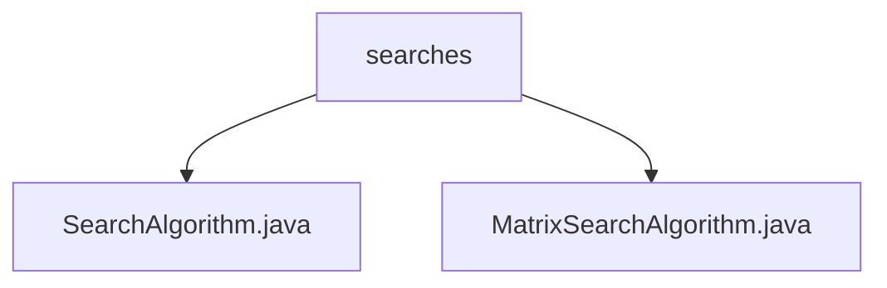

# 基础信息

|      |      |
|------|------|
| 名称 | searches |
| 编码语言 | .java |
| 代码路径 | Java/src/main/java/com/thealgorithms/devutils/searches |
| 包名 | Java.src.main.java.com.thealgorithms.devutils.searches |
| 概述说明 | 输入内容为空，无法生成总结描述。 |

# 说明

## 概述
该代码模块主要包含与搜索算法相关的实现，提供了基础的搜索算法接口以及针对矩阵的搜索算法实现。这些算法可能用于在数据结构中查找特定元素或满足特定条件的元素，适用于多种业务场景。

## 主要业务场景
1. **基础搜索**：`SearchAlgorithm.java` 文件可能定义了通用的搜索算法接口或实现，适用于在数组、列表等线性数据结构中进行元素查找。
2. **矩阵搜索**：`MatrixSearchAlgorithm.java` 文件可能提供了针对二维矩阵的搜索算法实现，适用于在矩阵中查找特定元素或满足特定条件的元素，例如在图像处理、游戏开发或数据分析中应用。

### 包内部结构视图

该流程图展示了路径的层级关系，`searches`文件夹包含两个文件：`SearchAlgorithm.java`和`MatrixSearchAlgorithm.java`。所有节点名称仅使用路径的最后一级元素，确保简洁明了。

# 文件列表 File List

| 名称   | 类型  | 说明 |
|-------|------|-------------|
| [MatrixSearchAlgorithm.java](MatrixSearchAlgorithm.md) | file | 信息为空，无法生成概要描述。 |
| [SearchAlgorithm.java](SearchAlgorithm.md) | file | 无内容提供，无法生成概要描述。 |

