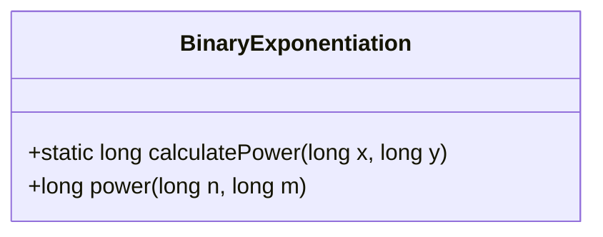
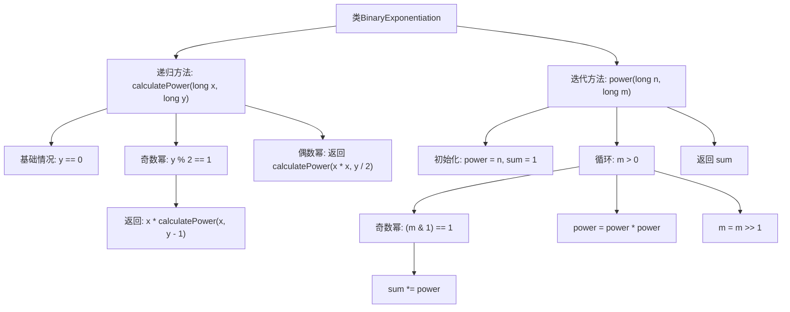

# 基础信息

|      |      |
|------|------|
| 名称 | BinaryExponentiation |
| 编码语言 | .java |
| 代码路径 | Java/src/main/java/com/thealgorithms/divideandconquer/BinaryExponentiation.java |
| 包名 | com.thealgorithms.divideandconquer |
| 依赖项 | [] |
| 概述说明 | 递归和迭代方法实现快速幂计算。 |

# 说明

递归和迭代方法实现快速幂计算。递归方法通过将问题分解为更小的子问题，逐步求解幂次，适用于理解递归思想。迭代方法通过循环结构，逐步累积结果，效率更高，适用于实际应用。两种方法都能有效计算幂次，但迭代方法在空间复杂度上更优，递归方法则更直观易理解。

# 类列表 Class Summary

| 名称   | 类型  | 说明 |
|-------|------|-------------|
| BinaryExponentiation | class | 递归和迭代方法实现快速幂计算。 |

## 类 BinaryExponentiation

|      |      |
|------|------|
| 访问范围 | public |
| 类型 | class |
| 名称 | BinaryExponentiation |
| 说明 | 递归和迭代方法实现快速幂计算。 |

### UML类图

**类图描述：**  
`BinaryExponentiation` 类包含两个方法：`calculatePower` 和 `power`。`calculatePower` 是一个递归方法，用于计算 `x` 的 `y` 次方，通过判断 `y` 的奇偶性来优化计算过程。`power` 是一个迭代方法，同样用于计算 `n` 的 `m` 次方，通过位运算和循环来实现高效的幂运算。这两个方法都展示了二分幂算法的不同实现方式。

### 内部方法调用关系图

该流程图展示了`BinaryExponentiation`类中的两个方法：递归方法`calculatePower`和迭代方法`power`。递归方法通过判断幂的奇偶性，分别处理奇数幂和偶数幂的情况。迭代方法则通过循环和位运算来计算幂次，最终返回结果。流程图清晰地展示了两个方法的执行流程和条件判断。

### 字段列表 Field List

| 名称  | 类型  | 说明 |
|-------|-------|------|

### 方法列表 Method List

| 名称  | 类型  | 说明 |
|-------|-------|------|
| calculatePower | long | 递归计算x的y次方，奇偶次方分别处理。 |
| power | long | 计算n的m次幂的快速幂算法。 |

