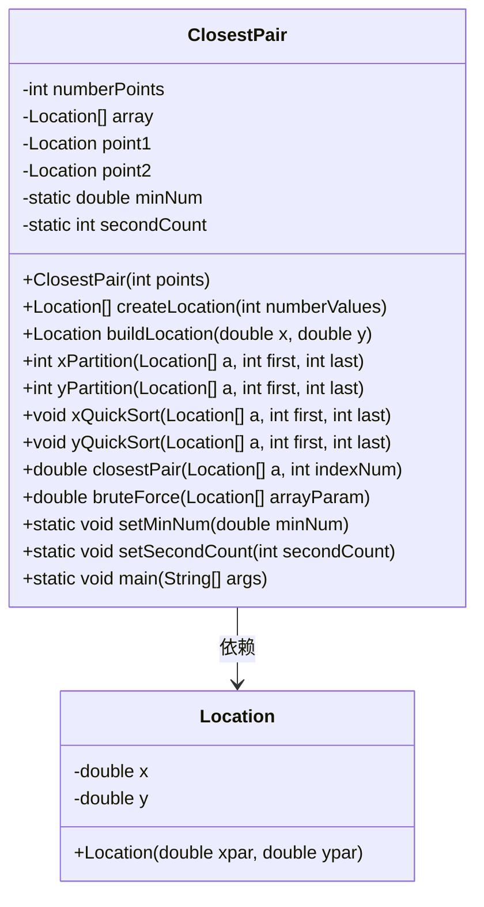
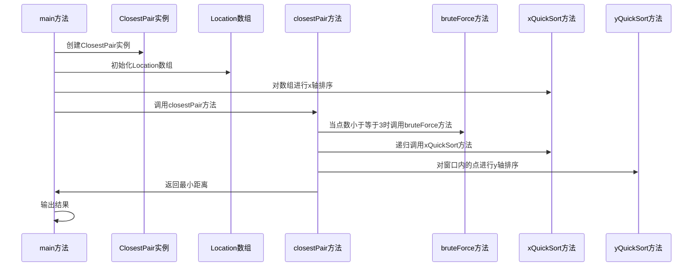

# 基础信息

|      |      |
|------|------|
| 名称 | ClosestPair |
| 编码语言 | .java |
| 代码路径 | Java/src/main/java/com/thealgorithms/divideandconquer/ClosestPair.java |
| 包名 | com.thealgorithms.divideandconquer |
| 依赖项 | [] |
| 概述说明 | ClosestPair类用于在平面上查找最近点对，支持快速排序和分治法。 |

# 说明

ClosestPair类是一个用于在平面上查找最近点对的工具，支持两种主要方法：快速排序和分治法。快速排序用于高效地对点进行排序，而分治法则通过递归地将问题分解为更小的子问题来找到最近的点对。该类结合了这两种算法，以确保在不同规模的数据集上都能高效地找到最近的点对。

# 类列表 Class Summary

| 名称   | 类型  | 说明 |
|-------|------|-------------|
| ClosestPair | class | ClosestPair类用于查找平面上最近的点对，支持快速排序和分治法。 |

## 类 ClosestPair

|      |      |
|------|------|
| 访问范围 | public final |
| 类型 | class |
| 名称 | ClosestPair |
| 说明 | ClosestPair类用于查找平面上最近的点对，支持快速排序和分治法。 |

### UML类图

**描述：**  
`ClosestPair` 类用于在给定的点集中找到最近的点对。它包含一个内部类 `Location`，用于存储点的坐标。`ClosestPair` 提供了多种方法，包括快速排序、分区算法以及暴力搜索，用于计算点对之间的最小距离。`closestPair` 方法通过递归分治法来优化搜索效率，而 `bruteForce` 方法则用于处理小规模点集。通过 `xQuickSort` 和 `yQuickSort` 方法，类能够对点集进行排序，以便更高效地找到最近点对。

### 内部方法调用关系图

```mermaid
graph TD
    A["类ClosestPair"]
    B["属性: int numberPoints"]
    C["属性: Location[] array"]
    D["属性: Location point1"]
    E["属性: Location point2"]
    F["属性: static double minNum"]
    G["属性: static int secondCount"]
    H["方法: static void setMinNum(double minNum)"]
    I["方法: static void setSecondCount(int secondCount)"]
    J["构造方法: ClosestPair(int points)"]
    K["内部类: Location"]
    L["属性: double x"]
    M["属性: double y"]
    N["构造方法: Location(double xpar, double ypar)"]
    O["方法: Location[] createLocation(int numberValues)"]
    P["方法: Location buildLocation(double x, double y)"]
    Q["方法: int xPartition(Location[] a, int first, int last)"]
    R["方法: int yPartition(Location[] a, int first, int last)"]
    S["方法: void xQuickSort(Location[] a, int first, int last)"]
    T["方法: void yQuickSort(Location[] a, int first, int last)"]
    U["方法: double closestPair(Location[] a, int indexNum)"]
    V["方法: double bruteForce(Location[] arrayParam)"]
    W["方法: static void main(String[] args)"]

    A --> B
    A --> C
    A --> D
    A --> E
    A --> F
    A --> G
    A --> H
    A --> I
    A --> J
    A --> K
    K --> L
    K --> M
    K --> N
    A --> O
    A --> P
    A --> Q
    A --> R
    A --> S
    A --> T
    A --> U
    A --> V
    A --> W
```

这段代码实现了一个用于寻找平面上最近点对的算法。ClosestPair类通过递归分治策略，将点集分成左右两部分，分别计算最近点对，然后合并结果。代码中包含了快速排序、分区、暴力求解等辅助方法，最终输出最近点对的坐标及其距离。流程图展示了类的结构和方法之间的调用关系，时序图则展示了从主方法调用到最终结果输出的执行流程。

### 字段列表 Field List

| 名称  | 类型  | 说明 |
|-------|-------|------|
| numberPoints | int | 声明一个整型变量numberPoints。 |
| secondCount = 0 | int | 私有静态整型变量secondCount初始化为0。 |
| point1 = null | Location | 变量Location point1未初始化，值为null。 |
| point2 = null | Location | 声明了一个未初始化的Location类型变量point2。 |
| array | Location[] | 声明一个名为array的Location类型数组。 |
| minNum = Double.MAX_VALUE | double | 私有静态变量minNum初始化为最大双精度值。 |

### 方法列表 Method List

| 名称  | 类型  | 说明 |
|-------|-------|------|
| createLocation | Location[] | 创建指定数量Location对象数组的方法。 |
| yQuickSort | void | 快速排序算法实现，递归分割数组并排序。 |
| setSecondCount | void | 设置ClosestPair类的secondCount静态变量值为传入的secondCount参数。 |
| setMinNum | void | 设置ClosestPair类的最小数值为minNum。 |
| xPartition | int | 实现数组分区，以最后一个元素为基准，返回基准索引。 |
| buildLocation | Location | 该方法根据给定的x和y坐标构建并返回一个Location对象。 |
| main | void | Java程序计算12个点的最近对，输出最小距离及对应坐标。 |
| bruteForce | double | 计算两点或三点间最小距离，并更新最小距离值。 |
| xQuickSort | void | 快速排序算法递归实现，通过分区函数确定基准点并排序左右子数组。 |
| closestPair | double | 分治法求解最近点对，递归分割数组，计算最小距离，窗口内优化比较。 |
| yPartition | int | 快速排序中按y值分区，返回pivot索引。 |

