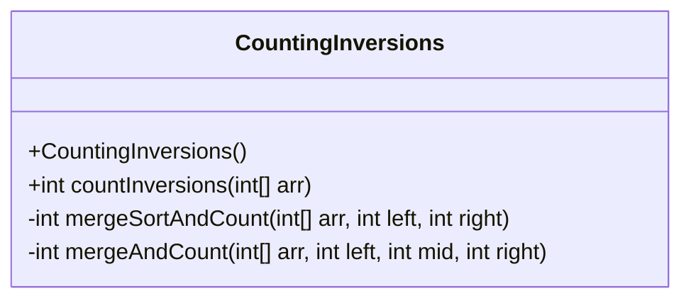
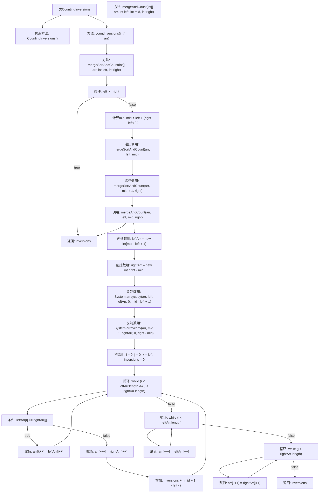

# 基础信息

|      |      |
|------|------|
| 名称 | CountingInversions |
| 编码语言 | .java |
| 代码路径 | Java/src/main/java/com/thealgorithms/divideandconquer/CountingInversions.java |
| 包名 | com.thealgorithms.divideandconquer |
| 依赖项 | [] |
| 概述说明 | 归并排序计算数组逆序对数量。 |

# 说明

该代码实现了一个通过归并排序算法来计算数组中逆序对数量的功能。归并排序在排序过程中能够有效地统计数组中逆序对的数量，逆序对指的是数组中前一个元素大于后一个元素的组合。该算法通过分治策略将数组不断分割，直到最小单位，然后在合并过程中统计逆序对的数量，最终返回数组中所有逆序对的总数。这种方法在时间效率上较为优越，适合处理大规模数据。

# 类列表 Class Summary

| 名称   | 类型  | 说明 |
|-------|------|-------------|
| CountingInversions | class | 该代码通过归并排序计算数组中逆序对的数量。 |

## 类 CountingInversions

|      |      |
|------|------|
| 访问范围 | public final |
| 类型 | class |
| 名称 | CountingInversions |
| 说明 | 该代码通过归并排序计算数组中逆序对的数量。 |

### UML类图

这段代码定义了一个名为 `CountingInversions` 的类，用于计算数组中逆序对的数量。该类包含一个私有的构造函数，确保无法实例化该类。主要功能通过 `countInversions` 方法实现，该方法调用 `mergeSortAndCount` 进行递归的归并排序，并在排序过程中计算逆序对的数量。`mergeAndCount` 方法用于合并两个已排序的子数组，并计算它们之间的交叉逆序对。整个流程通过归并排序的方式高效地计算逆序对的数量。

### 内部方法调用关系图

这段代码实现了一个计算数组中逆序对数量的算法。通过使用修改后的归并排序方法，递归地将数组分成两半，分别排序并计算逆序对，最后合并两个子数组并计算跨子数组的逆序对。流程图展示了类中的方法调用关系以及主要逻辑步骤的执行顺序。

### 字段列表 Field List

| 名称  | 类型  | 说明 |
|-------|-------|------|

### 方法列表 Method List

| 名称  | 类型  | 说明 |
|-------|-------|------|
| mergeAndCount | int | 合并数组并计算逆序数。 |
| countInversions | int | 静态方法计算数组逆序数，调用归并排序实现。 |
| mergeSortAndCount | int | 实现归并排序并计算逆序数的递归方法。 |

