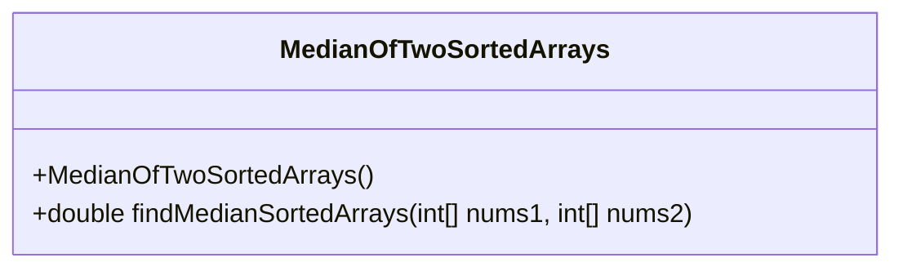
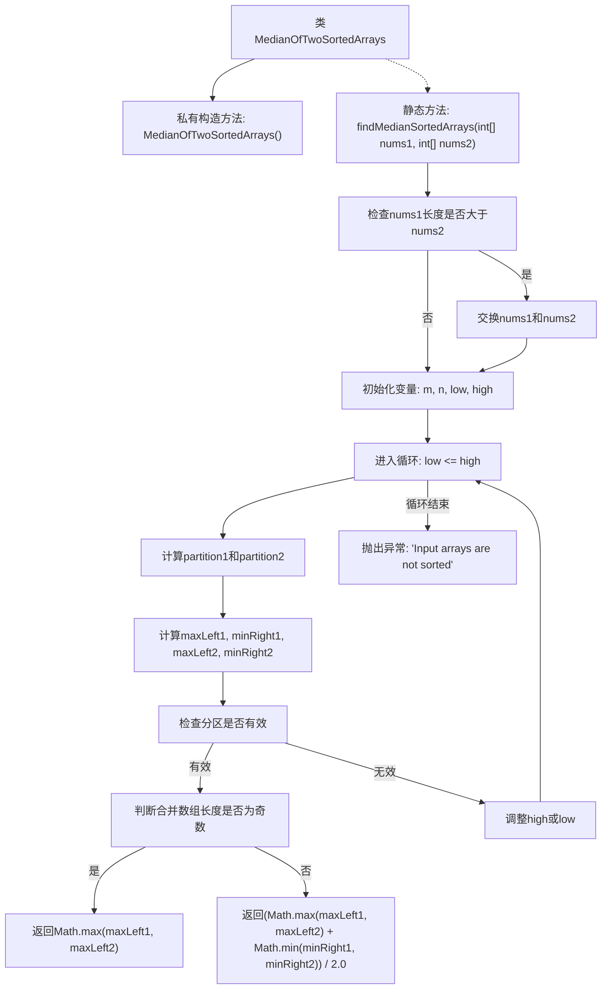

# 基础信息

|      |      |
|------|------|
| 名称 | MedianOfTwoSortedArrays |
| 编码语言 | .java |
| 代码路径 | Java/src/main/java/com/thealgorithms/divideandconquer/MedianOfTwoSortedArrays.java |
| 包名 | com.thealgorithms.divideandconquer |
| 依赖项 | [] |
| 概述说明 | 高效求解两个有序数组的中位数。 |

# 说明

该内容描述了一个用于求解两个有序数组中位数的算法，其时间复杂度为对数级别。这意味着算法在处理大规模数据时具有较高的效率，能够在较短时间内找到两个有序数组的中位数。对数时间复杂度的实现通常涉及二分查找等优化策略，确保算法在每一步都能显著减少搜索范围，从而快速定位中位数。

# 类列表 Class Summary

| 名称   | 类型  | 说明 |
|-------|------|-------------|
| MedianOfTwoSortedArrays | class | 求两个有序数组中位数的对数时间算法。 |

## 类 MedianOfTwoSortedArrays

|      |      |
|------|------|
| 访问范围 | public final |
| 类型 | class |
| 名称 | MedianOfTwoSortedArrays |
| 说明 | 求两个有序数组中位数的对数时间算法。 |

### UML类图

这段代码定义了一个名为 `MedianOfTwoSortedArrays` 的类，该类包含一个私有的构造函数和一个公有的静态方法 `findMedianSortedArrays`。该方法用于在两个已排序的数组中找到中位数，并且在输入数组未排序时会抛出 `IllegalArgumentException` 异常。类图展示了该类的结构，包括其构造函数和方法。

### 内部方法调用关系图

这段代码实现了一个静态方法 `findMedianSortedArrays`，用于在O(log(min(m, n)))时间内找到两个已排序数组的中位数。方法首先确保第一个数组是较短的数组，然后通过二分查找在两个数组中找到合适的分区，使得左半部分的最大值小于等于右半部分的最小值。根据合并后数组的长度是奇数还是偶数，返回相应的中位数。如果输入数组未排序，方法会抛出 `IllegalArgumentException` 异常。

### 字段列表 Field List

| 名称  | 类型  | 说明 |
|-------|-------|------|

### 方法列表 Method List

| 名称  | 类型  | 说明 |
|-------|-------|------|
| findMedianSortedArrays | double | 二分查找法求两有序数组中位数。 |

