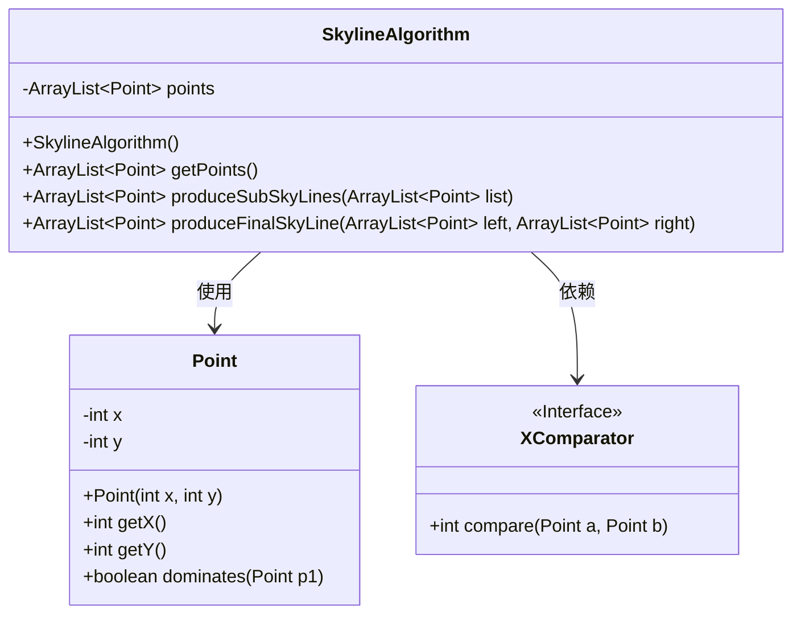
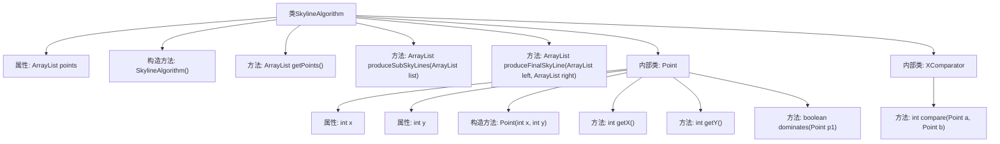
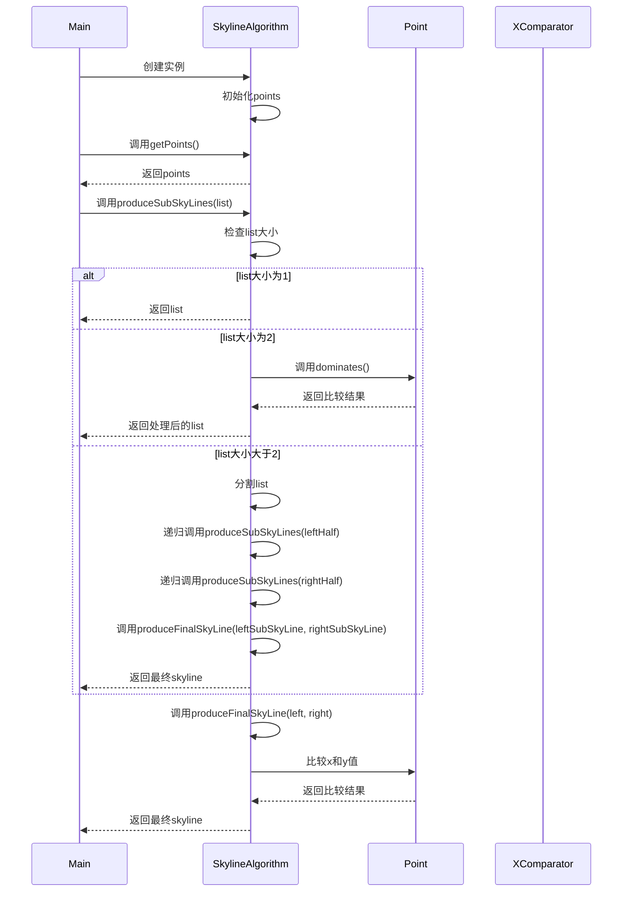

# 基础信息

|      |      |
|------|------|
| 名称 | SkylineAlgorithm |
| 编码语言 | .java |
| 代码路径 | Java/src/main/java/com/thealgorithms/divideandconquer/SkylineAlgorithm.java |
| 包名 | com.thealgorithms.divideandconquer |
| 依赖项 | ['java.util.ArrayList', 'java.util.Comparator'] |
| 概述说明 | Skyline算法类实现点管理、子天空线生成及合并功能。 |

# 说明

Skyline算法类是一个用于管理和处理点的数据结构，主要功能包括点管理、分治递归生成子天空线以及合并最终天空线。点管理部分负责处理和存储输入的点集，确保数据的有效组织和访问。分治递归生成子天空线通过递归方法将点集划分为更小的子集，并在每个子集中生成局部天空线。最后，合并最终天空线功能将各个子天空线合并成一个全局的天空线，确保结果的最优性和完整性。该算法类旨在高效地处理大规模点集，并生成准确的天际线结果。

# 类列表 Class Summary

| 名称   | 类型  | 说明 |
|-------|------|-------------|
| SkylineAlgorithm | class | Skyline算法类，包含点管理、分治递归生成子天空线及合并最终天空线功能。 |

## 类 SkylineAlgorithm

|      |      |
|------|------|
| 访问范围 | public |
| 类型 | class |
| 名称 | SkylineAlgorithm |
| 说明 | Skyline算法类，包含点管理、分治递归生成子天空线及合并最终天空线功能。 |

### UML类图

这段代码实现了一个用于计算二维点集的Skyline算法。`SkylineAlgorithm`类包含一个`Point`类的列表，并通过分治法递归地生成子Skyline，最终合并为完整的Skyline。`Point`类表示二维点，并提供了判断一个点是否支配另一个点的方法。`XComparator`类实现了`Comparator`接口，用于根据点的x值进行比较和排序。整个过程通过递归和合并操作逐步构建最终的Skyline。

### 内部方法调用关系图

这段代码实现了一个Skyline算法，用于处理二维点集并生成天际线。代码首先初始化一个点集，然后通过递归的分治算法将点集分割成更小的子集，并在每个子集中移除被支配的点。最后，通过合并处理后的子集生成最终的天际线。内部类Point用于表示二维点，并提供了支配关系的判断方法。XComparator类用于根据x值对点进行排序。

### 字段列表 Field List

| 名称  | 类型  | 说明 |
|-------|-------|------|
| points | ArrayList<Point> | 私有数组列表存储点对象。 |

### 方法列表 Method List

| 名称  | 类型  | 说明 |
|-------|-------|------|
| getPoints | ArrayList<Point> | 该方法返回一个包含Point对象的ArrayList集合。 |
| produceFinalSkyLine | ArrayList<Point> | 合并并优化左右点集，生成最终天际线。 |
| produceSubSkyLines | ArrayList<Point> | 递归生成子天际线，处理单点、两点及多点情况，最终合并结果。 |

