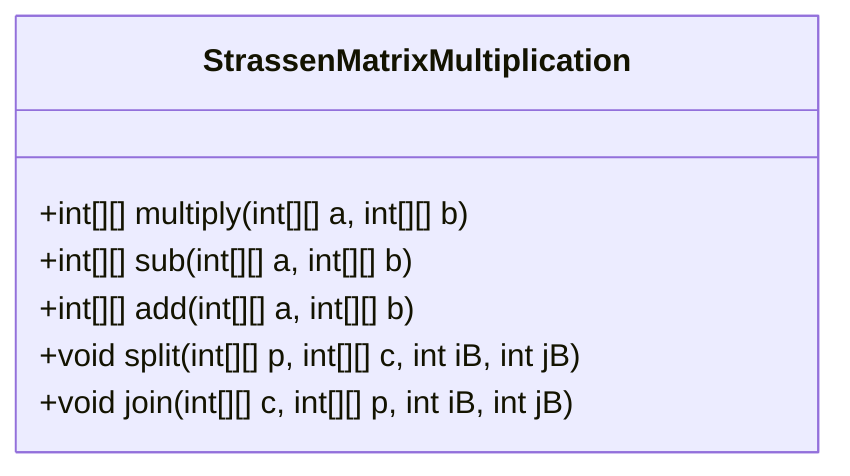
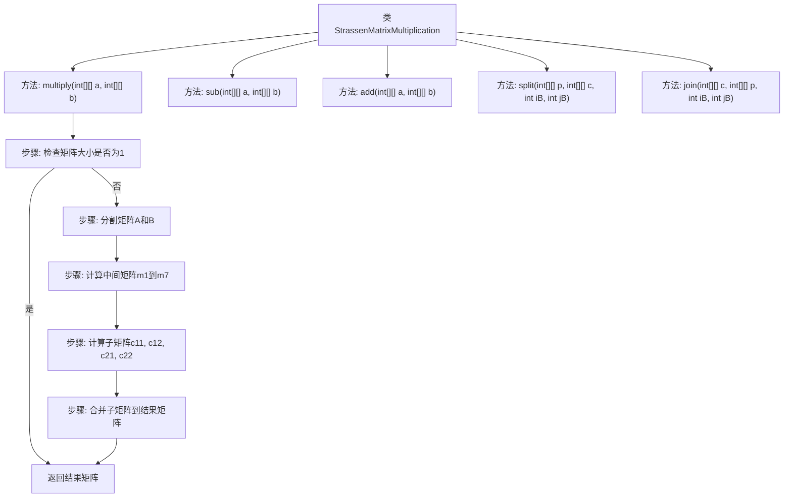

# 基础信息

|      |      |
|------|------|
| 名称 | StrassenMatrixMultiplication |
| 编码语言 | .java |
| 代码路径 | Java/src/main/java/com/thealgorithms/divideandconquer/StrassenMatrixMultiplication.java |
| 包名 | com.thealgorithms.divideandconquer |
| 依赖项 | [] |
| 概述说明 | Strassen算法利用分治法和矩阵运算优化矩阵乘法计算效率。 |

# 说明

Strassen算法是一种用于矩阵乘法的优化方法，采用分治法将矩阵分解为更小的子矩阵，并通过特定的矩阵运算减少乘法次数，从而提升计算效率。相比传统矩阵乘法，该算法在时间复杂度上有显著改进，适用于大规模矩阵计算场景。

# 类列表 Class Summary

| 名称   | 类型  | 说明 |
|-------|------|-------------|
| StrassenMatrixMultiplication | class | Strassen算法实现矩阵乘法，通过分治法和矩阵运算优化计算效率。 |

## 类 StrassenMatrixMultiplication

|      |      |
|------|------|
| 访问范围 | public |
| 类型 | class |
| 名称 | StrassenMatrixMultiplication |
| 说明 | Strassen算法实现矩阵乘法，通过分治法和矩阵运算优化计算效率。 |

### UML类图

### 描述
`StrassenMatrixMultiplication` 类实现了 Strassen 矩阵乘法算法，用于高效地计算两个矩阵的乘积。该类提供了矩阵的乘法、加法、减法操作，以及将矩阵分割和合并的功能。通过递归地将矩阵分割为更小的子矩阵，并使用 Strassen 的公式进行计算，最终将结果合并为最终的乘积矩阵。这种方法比传统的矩阵乘法算法在时间复杂度上更具优势，尤其是在处理大规模矩阵时。

### 内部方法调用关系图

这段代码实现了Strassen矩阵乘法算法，通过递归地将矩阵分割为更小的子矩阵，并利用中间矩阵的计算来减少乘法次数，从而提高矩阵乘法的效率。流程图中详细展示了算法的各个步骤，包括矩阵的分割、中间矩阵的计算、子矩阵的合并以及最终结果矩阵的返回。

### 字段列表 Field List

| 名称  | 类型  | 说明 |
|-------|-------|------|

### 方法列表 Method List

| 名称  | 类型  | 说明 |
|-------|-------|------|
| add | int[][] | 二维矩阵相加，返回结果矩阵。 |
| join | void | 将二维数组c的内容复制到数组p的指定位置。 |
| multiply | int[][] | 矩阵乘法分治法实现，递归分割矩阵并计算子矩阵乘积，最终合并结果。 |
| sub | int[][] | 该方法用于计算两个二维整数数组的差值，返回结果数组。 |
| split | void | 该方法将二维数组p的子块复制到数组c中，起始位置为iB和jB。 |

