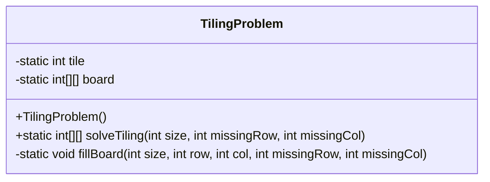
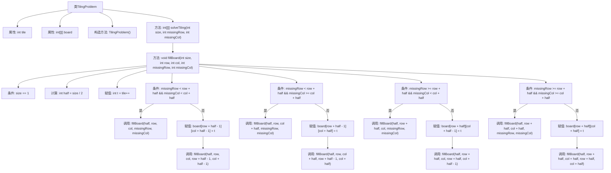

# 基础信息

|      |      |
|------|------|
| 名称 | TilingProblem |
| 编码语言 | .java |
| 代码路径 | Java/src/main/java/com/thealgorithms/divideandconquer/TilingProblem.java |
| 包名 | com.thealgorithms.divideandconquer |
| 依赖项 | [] |
| 概述说明 | L形瓷砖填充算法解决2^n x 2^n棋盘缺一格问题。 |

# 说明

解决2^n x 2^n棋盘缺一格问题的L形瓷砖填充算法，是一种递归分治策略。该算法将棋盘划分为四个大小相等的子棋盘，其中一个子棋盘包含缺失的格子。通过递归处理每个子棋盘，确保每个子棋盘都缺失一个格子。在每次递归中，使用L形瓷砖覆盖三个不含缺失格子的子棋盘的连接处，从而逐步填充整个棋盘。此方法确保了棋盘最终被完全覆盖，且每个L形瓷砖恰好覆盖三个格子。该算法的时间复杂度为O(4^n)，适用于任意大小为2^n x 2^n的棋盘。

# 类列表 Class Summary

| 名称   | 类型  | 说明 |
|-------|------|-------------|
| TilingProblem | class | 解决2^n x 2^n棋盘缺一格问题的L形瓷砖填充算法。 |

## 类 TilingProblem

|      |      |
|------|------|
| 访问范围 | public final |
| 类型 | class |
| 名称 | TilingProblem |
| 说明 | 解决2^n x 2^n棋盘缺一格问题的L形瓷砖填充算法。 |

### UML类图

**描述：**  
`TilingProblem` 类用于解决一个经典的平铺问题，即在大小为 `2^n x 2^n` 的棋盘上，用L形瓷砖覆盖棋盘，其中有一个方格缺失。该类包含一个私有的静态变量 `tile` 用于标记瓷砖，以及一个私有的静态二维数组 `board` 表示棋盘。`solveTiling` 方法用于初始化棋盘并调用 `fillBoard` 方法递归地填充棋盘。`fillBoard` 方法将棋盘分为四个象限，并根据缺失方格的位置放置L形瓷砖，递归处理每个象限，直到整个棋盘被填满。

### 内部方法调用关系图

这段代码实现了一个解决棋盘覆盖问题的算法，通过递归地将棋盘划分为四个象限，并在每个象限中放置L形瓷砖来覆盖棋盘。代码首先初始化棋盘，然后根据缺失方块的位置递归地填充每个象限，直到整个棋盘被覆盖。流程图展示了类的主要方法和递归调用的逻辑结构。

### 字段列表 Field List

| 名称  | 类型  | 说明 |
|-------|-------|------|
| board | int[][] | 定义私有静态二维整型数组board。 |
| tile = 1 | int | 定义了一个私有的静态整型变量tile，初始值为1。 |

### 方法列表 Method List

| 名称  | 类型  | 说明 |
|-------|-------|------|
| fillBoard | void | 递归填充棋盘，根据缺失位置处理四个象限。 |
| solveTiling | int[][] | 静态方法`solveTiling`生成并返回填充后的二维数组棋盘。 |

