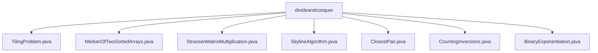

# 基础信息

|      |      |
|------|------|
| 名称 | divideandconquer |
| 编码语言 | .java |
| 代码路径 | Java/src/main/java/com/thealgorithms/divideandconquer |
| 包名 | Java.src.main.java.com.thealgorithms.divideandconquer |
| 概述说明 | 递归分治策略解决棋盘填充、中位数查找、矩阵乘法、天空线生成、最近点对查找、逆序对统计及快速幂计算。 |

# 说明

## 概述
该代码模块主要围绕分治算法（Divide and Conquer）的实现展开，涵盖了多个经典问题的解决方案。分治算法通过将问题分解为更小的子问题，递归地解决这些子问题，并将结果合并以得到最终解。该模块中的算法包括棋盘填充、中位数查找、矩阵乘法、天际线生成、最近点对查找、逆序对统计以及快速幂计算等。这些算法在处理大规模数据或复杂问题时表现出较高的效率，尤其适用于需要递归分解和合并的场景。

## 主要业务场景
1. **棋盘填充问题**：解决2^n x 2^n棋盘缺一格问题的L形瓷砖填充算法，通过递归分治策略将棋盘划分为四个子棋盘，并使用L形瓷砖覆盖连接处，确保棋盘被完全覆盖。
2. **中位数查找**：在两个有序数组中查找中位数，采用对数时间复杂度的算法，通常基于二分查找等优化策略，适用于大规模数据处理。
3. **矩阵乘法**：Strassen算法通过将矩阵分解为更小的子矩阵，并减少乘法次数，提升大规模矩阵乘法的计算效率。
4. **天际线生成**：Skyline算法通过分治递归生成子天空线，并合并生成全局天空线，适用于处理大规模点集并生成准确的天际线结果。
5. **最近点对查找**：ClosestPair类结合快速排序和分治法，高效地在平面上查找最近的点对，适用于不同规模的数据集。
6. **逆序对统计**：通过归并排序算法统计数组中逆序对的数量，适用于处理大规模数据并高效计算逆序对。
7. **快速幂计算**：递归和迭代方法实现快速幂计算，递归方法直观易理解，迭代方法在空间复杂度上更优，适用于实际应用中的幂次计算。

这些算法广泛应用于计算机科学中的多个领域，如数据结构、算法优化、图形处理、数值计算等，展示了分治策略在解决复杂问题中的强大能力。

### 包内部结构视图

该流程图展示了`divideandconquer`目录下的所有Java文件，包括`TilingProblem.java`、`MedianOfTwoSortedArrays.java`、`StrassenMatrixMultiplication.java`、`SkylineAlgorithm.java`、`ClosestPair.java`、`CountingInversions.java`和`BinaryExponentiation.java`。这些文件均直接隶属于`divideandconquer`目录，没有进一步的子目录层级。

# 文件列表 File List

| 名称   | 类型  | 说明 |
|-------|------|-------------|
| [BinaryExponentiation.java](BinaryExponentiation.md) | file | 递归和迭代方法实现快速幂计算。 |
| [StrassenMatrixMultiplication.java](StrassenMatrixMultiplication.md) | file | Strassen算法利用分治法和矩阵运算优化矩阵乘法计算效率。 |
| [CountingInversions.java](CountingInversions.md) | file | 归并排序计算数组逆序对数量。 |
| [ClosestPair.java](ClosestPair.md) | file | ClosestPair类用于在平面上查找最近点对，支持快速排序和分治法。 |
| [SkylineAlgorithm.java](SkylineAlgorithm.md) | file | Skyline算法类实现点管理、子天空线生成及合并功能。 |
| [MedianOfTwoSortedArrays.java](MedianOfTwoSortedArrays.md) | file | 高效求解两个有序数组的中位数。 |
| [TilingProblem.java](TilingProblem.md) | file | L形瓷砖填充算法解决2^n x 2^n棋盘缺一格问题。 |

