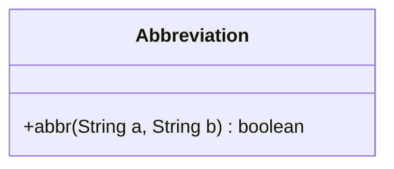
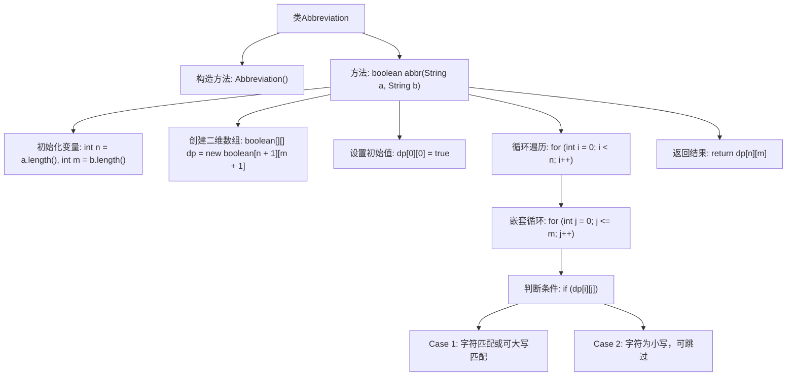

# 基础信息

|      |      |
|------|------|
| 名称 | Abbreviation |
| 编码语言 | .java |
| 代码路径 | Java/src/main/java/com/thealgorithms/dynamicprogramming/Abbreviation.java |
| 包名 | com.thealgorithms.dynamicprogramming |
| 依赖项 | [] |
| 概述说明 | Abbreviation类用动态规划判断a能否通过大写和删除操作转为b。 |

# 说明

Abbreviation类使用动态规划算法来判断字符串a是否可以通过将部分字母转换为大写字母和删除某些字符的操作，最终转换为字符串b。该方法通过逐步分析字符串a和b的字符匹配情况，确保在每一步操作中都能找到合适的转换或删除策略，从而实现从a到b的转换。

# 类列表 Class Summary

| 名称   | 类型  | 说明 |
|-------|------|-------------|
| Abbreviation | class | Abbreviation类通过动态规划判断字符串a能否通过大写字母和删除操作转换为字符串b。 |

## 类 Abbreviation

|      |      |
|------|------|
| 访问范围 | public final |
| 类型 | class |
| 名称 | Abbreviation |
| 说明 | Abbreviation类通过动态规划判断字符串a能否通过大写字母和删除操作转换为字符串b。 |

### UML类图

这段代码定义了一个名为 `Abbreviation` 的类，该类包含一个静态方法 `abbr`，用于判断字符串 `a` 是否可以通过将某些小写字母转换为大写字母并删除其余字符来转换为字符串 `b`。方法使用动态规划（DP）来解决问题，时间复杂度为 O(n * m)，空间复杂度为 O(n * m)，其中 n 和 m 分别是字符串 `a` 和 `b` 的长度。类图展示了 `Abbreviation` 类的结构，其中 `abbr` 方法是公有的，用于执行上述逻辑。

### 内部方法调用关系图

这段代码实现了一个动态规划算法，用于判断字符串 `a` 是否可以通过大写化某些字符并删除其他字符来转换为字符串 `b`。代码通过创建一个二维布尔数组 `dp` 来记录匹配状态，并通过遍历字符串 `a` 和 `b` 来更新 `dp` 数组。最终，`dp[n][m]` 的值决定了 `a` 是否可以转换为 `b`。该算法的时间复杂度和空间复杂度均为 O(n * m)。

### 字段列表 Field List

| 名称  | 类型  | 说明 |
|-------|-------|------|

### 方法列表 Method List

| 名称  | 类型  | 说明 |
|-------|-------|------|
| abbr | boolean | 动态规划判断字符串a能否缩写为字符串b。 |

