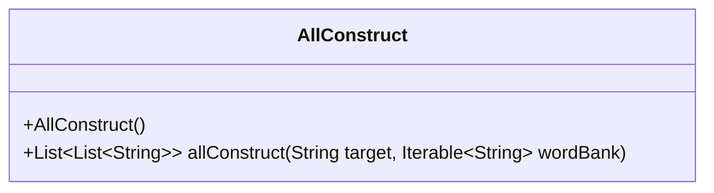
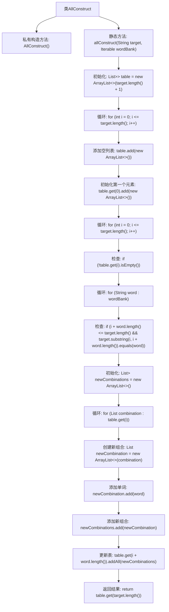

# 基础信息

|      |      |
|------|------|
| 名称 | AllConstruct |
| 编码语言 | .java |
| 代码路径 | Java/src/main/java/com/thealgorithms/dynamicprogramming/AllConstruct.java |
| 包名 | com.thealgorithms.dynamicprogramming |
| 依赖项 | ['java.util.ArrayList', 'java.util.List'] |
| 概述说明 | 查找构造目标字符串的所有方法，时间复杂度O(n*m*k)，空间复杂度O(n*m)。 |

# 说明

该内容描述了一个算法问题，目标是查找所有使用词库构造目标字符串的方法。算法的时间复杂度为O(n*m*k)，其中n是目标字符串的长度，m是词库中单词的平均长度，k是词库中单词的数量。空间复杂度为O(n*m)，表示算法在运行过程中所需的最大存储空间。该问题涉及动态规划或回溯等技术的应用，以高效地找到所有可能的构造方式。

# 类列表 Class Summary

| 名称   | 类型  | 说明 |
|-------|------|-------------|
| AllConstruct | class | 查找所有用词库构造目标字符串的方法，时间复杂O(n*m*k)，空间复杂O(n*m)。 |

## 类 AllConstruct

|      |      |
|------|------|
| 访问范围 | public final |
| 类型 | class |
| 名称 | AllConstruct |
| 说明 | 查找所有用词库构造目标字符串的方法，时间复杂O(n*m*k)，空间复杂O(n*m)。 |

### UML类图

### 类图描述
`AllConstruct` 类是一个工具类，用于计算所有可能的组合方式来构造目标字符串。它包含一个私有构造函数，防止实例化，并提供了一个静态方法 `allConstruct`，该方法接受目标字符串和单词库作为参数，返回一个包含所有可能组合的列表。该方法通过动态规划的方式实现，时间复杂度为 O(n * m * k)，空间复杂度为 O(n * m)，其中 n 是目标字符串的长度，m 是单词库中的单词数量，k 是单词的平均长度。

### 内部方法调用关系图

这段代码定义了一个名为 `AllConstruct` 的类，其中包含一个私有构造方法和一个静态方法 `allConstruct`。该方法用于找到所有可能的组合方式，使用给定的 `wordBank` 中的子字符串来构造目标字符串 `target`。通过动态规划的方式，代码初始化一个表来存储所有可能的组合，并在循环中逐步构建这些组合，最终返回所有有效的构造方式。

### 字段列表 Field List

| 名称  | 类型  | 说明 |
|-------|-------|------|

### 方法列表 Method List

| 名称  | 类型  | 说明 |
|-------|-------|------|
| allConstruct | List<List<String>> | 动态规划方法生成目标字符串的所有组合。 |

