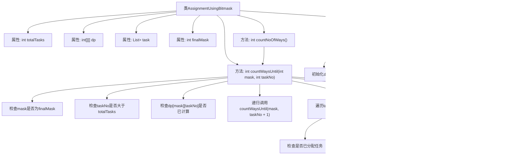

# 基础信息

|      |      |
|------|------|
| 名称 | AssignmentUsingBitmask |
| 编码语言 | .java |
| 代码路径 | Java/src/main/java/com/thealgorithms/dynamicprogramming/AssignmentUsingBitmask.java |
| 包名 | com.thealgorithms.dynamicprogramming |
| 依赖项 | ['java.util.ArrayList', 'java.util.Arrays', 'java.util.List'] |
| 概述说明 | 使用位掩码计算任务分配方式数。 |

# 说明

类AssignmentUsingBitmask通过位掩码技术计算任务分配方式的数量。位掩码是一种高效的数据表示方法，用于处理任务分配中的组合问题。该类利用位掩码的特性，快速枚举所有可能的任务分配方式，并计算其总数。这种方法在处理大规模任务分配问题时，能够显著提高计算效率，适用于需要精确计算任务分配方案数的场景。

# 类列表 Class Summary

| 名称   | 类型  | 说明 |
|-------|------|-------------|
| AssignmentUsingBitmask | class | 类AssignmentUsingBitmask通过位掩码计算任务分配方式数。 |

## 类 AssignmentUsingBitmask

|      |      |
|------|------|
| 访问范围 | public final |
| 类型 | class |
| 名称 | AssignmentUsingBitmask |
| 说明 | 类AssignmentUsingBitmask通过位掩码计算任务分配方式数。 |

### UML类图

**描述：**  
`AssignmentUsingBitmask` 类用于计算将任务分配给人员的方式总数。它使用位掩码（bitmask）来表示任务的分配状态，并通过动态规划（DP）来优化计算过程。类的构造函数初始化任务列表和DP数组，`countWaysUntil` 方法递归计算特定任务编号和掩码下的分配方式，`countNoOfWays` 方法则调用 `countWaysUntil` 返回总分配方式数。

### 内部方法调用关系图

**描述：**
该流程图展示了`AssignmentUsingBitmask`类的结构及其方法调用关系。类包含属性`totalTasks`、`dp`、`task`和`finalMask`，并通过构造方法初始化这些属性。`countWaysUntil`方法递归计算任务分配的方式，`countNoOfWays`方法调用`countWaysUntil`以返回总的任务分配方式。流程图详细描述了每个方法的内部逻辑和调用顺序。

### 字段列表 Field List

| 名称  | 类型  | 说明 |
|-------|-------|------|
| totalTasks | int | 私有整型变量totalTasks。 |
| dp | int[][] | 声明一个私有的二维整型数组dp。 |
| task | List<List<Integer>> | 私有不可变整数列表的列表类型变量task。 |
| finalMask | int | 声明一个私有的不可变整数变量finalMask。 |

### 方法列表 Method List

| 名称  | 类型  | 说明 |
|-------|-------|------|
| countNoOfWays | int | 方法countNoOfWays调用countWaysUntil计算方式数量。 |
| countWaysUntil | int | 递归计算任务分配方式，使用动态规划优化。 |

