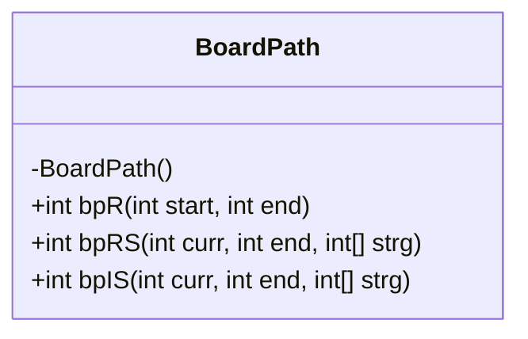
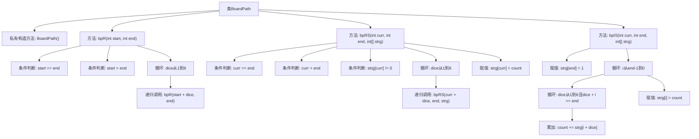

# 基础信息

|      |      |
|------|------|
| 名称 | BoardPath |
| 编码语言 | .java |
| 代码路径 | Java/src/main/java/com/thealgorithms/dynamicprogramming/BoardPath.java |
| 包名 | com.thealgorithms.dynamicprogramming |
| 依赖项 | [] |
| 概述说明 | BoardPath类提供三种路径计算方法：无缓存递归、有缓存递归、迭代表驱动。 |

# 说明

BoardPath类提供了三种方法来计算从起点到终点的路径数。第一种方法是递归无缓存，直接通过递归调用计算路径数，但效率较低。第二种方法是递归有缓存，在递归过程中使用缓存存储已计算结果，提高效率。第三种方法是迭代表驱动，通过迭代方式填充表格来计算路径数，避免递归调用，效率更高。这三种方法分别展示了不同的计算路径数的策略，适用于不同的场景和需求。

# 类列表 Class Summary

| 名称   | 类型  | 说明 |
|-------|------|-------------|
| BoardPath | class | BoardPath类提供三种方法计算从起点到终点的路径数：递归无缓存、递归有缓存、迭代表驱动。 |

## 类 BoardPath

|      |      |
|------|------|
| 访问范围 | public final |
| 类型 | class |
| 名称 | BoardPath |
| 说明 | BoardPath类提供三种方法计算从起点到终点的路径数：递归无缓存、递归有缓存、迭代表驱动。 |

### UML类图

**描述：**  
`BoardPath` 类提供了三种不同的方法来解决棋盘路径问题，计算从起点到终点的路径数量。`bpR` 方法使用递归但未优化，`bpRS` 方法在递归基础上引入了记忆化存储以提高效率，`bpIS` 方法则通过迭代和动态规划的方式解决问题。这些方法展示了从简单递归到优化算法的逐步演进，适用于不同规模和性能要求的场景。

### 内部方法调用关系图

这段代码定义了一个名为`BoardPath`的类，其中包含三个静态方法：`bpR`、`bpRS`和`bpIS`，分别用于计算从起点到终点的路径数量。`bpR`使用递归方法，`bpRS`在递归基础上增加了备忘录优化，`bpIS`则使用迭代和表格法来计算路径数量。每个方法都通过不同的策略来避免重复计算，提高效率。

### 字段列表 Field List

| 名称  | 类型  | 说明 |
|-------|-------|------|

### 方法列表 Method List

| 名称  | 类型  | 说明 |
|-------|-------|------|
| bpR | int | 递归计算从起点到终点的路径数，步长为1到6。 |
| bpIS | int | 该方法通过动态规划计算从当前位置到终点的路径数。 |
| bpRS | int | 递归计算从起点到终点的路径数，使用数组存储中间结果。 |

