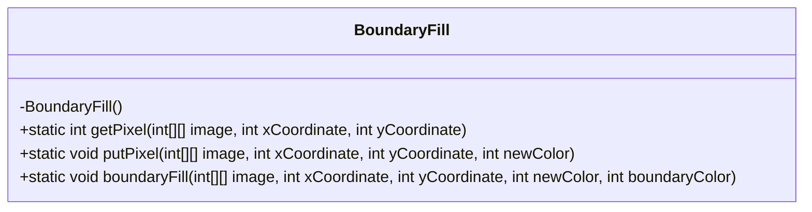
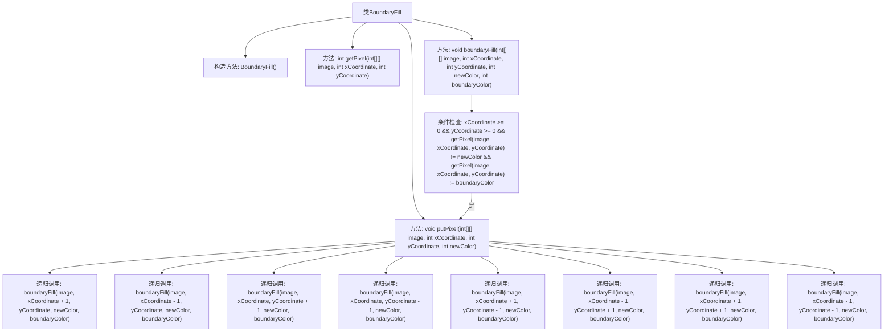

# 基础信息

|      |      |
|------|------|
| 名称 | BoundaryFill |
| 编码语言 | .java |
| 代码路径 | Java/src/main/java/com/thealgorithms/dynamicprogramming/BoundaryFill.java |
| 包名 | com.thealgorithms.dynamicprogramming |
| 依赖项 | [] |
| 概述说明 | BoundaryFill类实现图像像素颜色获取、设置及边界填充功能。 |

# 说明

BoundaryFill类用于实现图像填充功能，支持获取和设置像素颜色，并具备边界填充能力。该类通过操作像素颜色，能够对图像进行有效的填充处理，确保在边界范围内实现精确的填充效果。

# 类列表 Class Summary

| 名称   | 类型  | 说明 |
|-------|------|-------------|
| BoundaryFill | class | BoundaryFill类实现图像填充，支持获取、设置像素颜色及边界填充功能。 |

## 类 BoundaryFill

|      |      |
|------|------|
| 访问范围 | public final |
| 类型 | class |
| 名称 | BoundaryFill |
| 说明 | BoundaryFill类实现图像填充，支持获取、设置像素颜色及边界填充功能。 |

### UML类图

**描述：**
`BoundaryFill` 类是一个工具类，用于在二维图像中进行边界填充操作。它提供了三个静态方法：`getPixel` 用于获取指定坐标的像素颜色，`putPixel` 用于在指定坐标设置新的像素颜色，`boundaryFill` 则是一个递归方法，用于填充图像中指定区域的新颜色，直到遇到边界颜色为止。该类通过递归的方式实现了八方向的填充，确保填充区域内的所有像素都被正确替换。

### 内部方法调用关系图

这段代码定义了一个`BoundaryFill`类，主要用于对二维图像进行边界填充操作。类中包含三个方法：`getPixel`用于获取指定坐标的像素值，`putPixel`用于设置指定坐标的像素值，`boundaryFill`则通过递归调用实现边界填充。流程图展示了类的方法调用关系，特别是`boundaryFill`方法中的条件检查和递归调用过程。

### 字段列表 Field List

| 名称  | 类型  | 说明 |
|-------|-------|------|

### 方法列表 Method List

| 名称  | 类型  | 说明 |
|-------|-------|------|
| getPixel | int | 获取二维数组中指定坐标的像素值。 |
| boundaryFill | void | 递归填充图像区域，避开边界颜色。 |
| putPixel | void | 在二维数组中设置指定坐标的像素颜色为新颜色。 |

