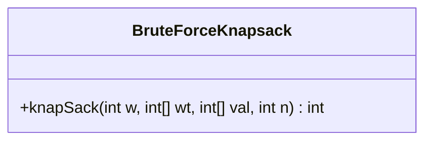
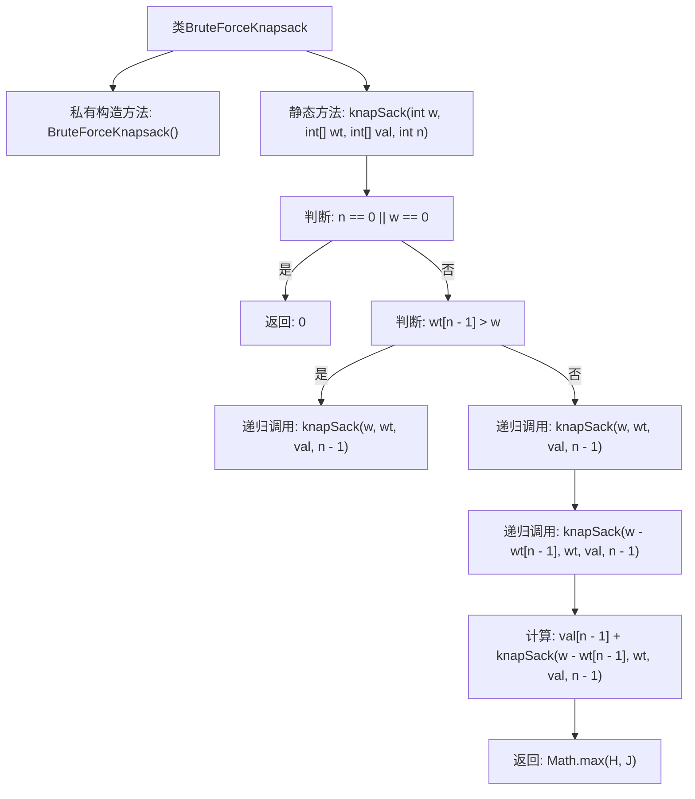

# 基础信息

|      |      |
|------|------|
| 名称 | BruteForceKnapsack |
| 编码语言 | .java |
| 代码路径 | Java/src/main/java/com/thealgorithms/dynamicprogramming/BruteForceKnapsack.java |
| 包名 | com.thealgorithms.dynamicprogramming |
| 依赖项 | [] |
| 概述说明 | BruteForceKnapsack类递归暴力求解0-1背包问题，返回最大价值。 |

# 说明

BruteForceKnapsack类采用递归方法暴力求解0-1背包问题，旨在找到物品组合的最大价值。该方法通过穷举所有可能的物品选择方案，计算每种方案的总价值，并从中选取最优解。尽管该方法简单直观，但由于其计算复杂度较高，适用于小规模问题。最终，该类返回满足背包容量限制的最大价值。

# 类列表 Class Summary

| 名称   | 类型  | 说明 |
|-------|------|-------------|
| BruteForceKnapsack | class | BruteForceKnapsack类通过递归暴力求解0-1背包问题，返回最大价值。 |

## 类 BruteForceKnapsack

|      |      |
|------|------|
| 访问范围 | public final |
| 类型 | class |
| 名称 | BruteForceKnapsack |
| 说明 | BruteForceKnapsack类通过递归暴力求解0-1背包问题，返回最大价值。 |

### UML类图

**描述：**  
`BruteForceKnapsack` 类是一个工具类，用于解决0-1背包问题。它包含一个静态方法 `knapSack`，该方法通过递归的暴力搜索来计算在给定背包容量和物品重量、价值的情况下，能够获得的最大价值。该方法考虑了两种选择：是否将当前物品放入背包，并返回这两种选择中的最大值。类本身是 `final` 且构造函数为私有，表明该类不可被继承且不可实例化，仅通过静态方法提供功能。

### 内部方法调用关系图

这段代码实现了一个递归的0-1背包问题解决方案。`knapSack`方法通过递归探索所有可能的物品组合，判断每个物品是否放入背包，最终返回在给定容量下可以获得的最大价值。流程图展示了方法的执行逻辑，包括基础情况判断、递归调用以及最大值的计算过程。

### 字段列表 Field List

| 名称  | 类型  | 说明 |
|-------|-------|------|

### 方法列表 Method List

| 名称  | 类型  | 说明 |
|-------|-------|------|
| knapSack | int | 动态规划解决背包问题，递归计算最大价值。 |

