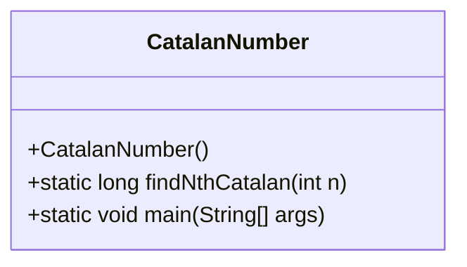
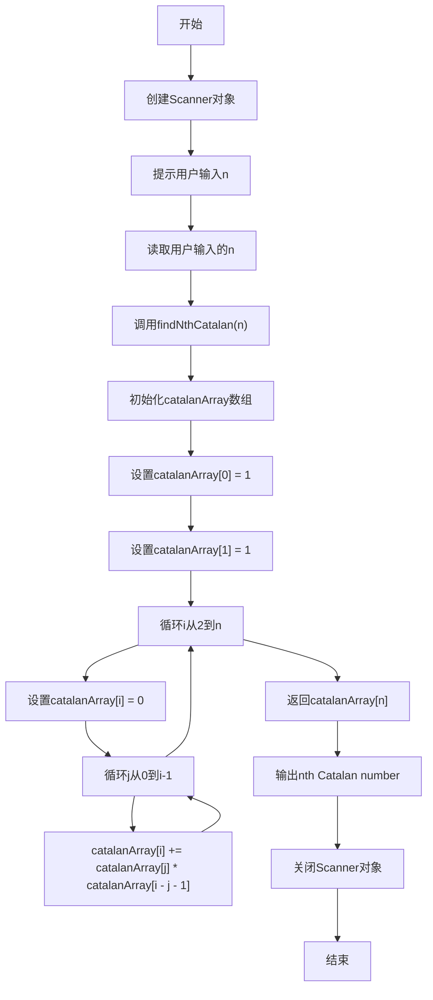
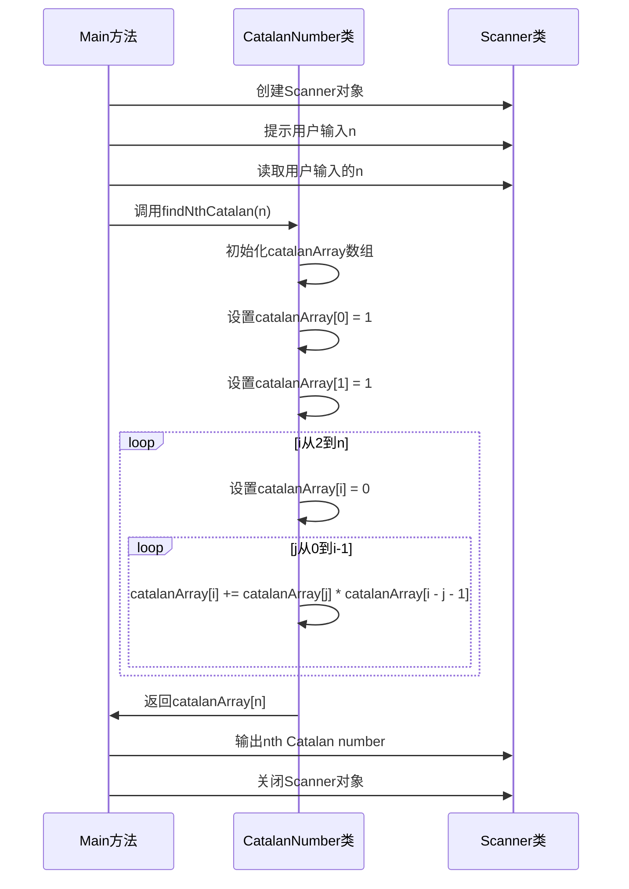
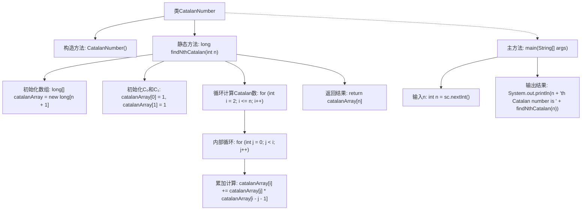

# 基础信息

|      |      |
|------|------|
| 名称 | CatalanNumber |
| 编码语言 | .java |
| 代码路径 | Java/src/main/java/com/thealgorithms/dynamicprogramming/CatalanNumber.java |
| 包名 | com.thealgorithms.dynamicprogramming |
| 依赖项 | ['java.util.Scanner'] |
| 概述说明 | 使用动态规划计算第n个卡特兰数，n最大为50。 |

# 说明

计算第n个卡特兰数，其中n的取值范围为小于等于50，采用动态规划方法实现。动态规划通过构建一个数组来存储中间结果，避免重复计算，从而提高效率。具体步骤包括初始化基础情况，然后通过递推关系逐步计算并填充数组，最终得到第n个卡特兰数的值。该方法确保了计算过程的高效性和准确性，适用于处理较大范围内的卡特兰数计算问题。

# 类列表 Class Summary

| 名称   | 类型  | 说明 |
|-------|------|-------------|
| CatalanNumber | class | 计算第n个卡特兰数，n小于等于50，使用动态规划实现。 |

## 类 CatalanNumber

|      |      |
|------|------|
| 访问范围 | public final |
| 类型 | class |
| 名称 | CatalanNumber |
| 说明 | 计算第n个卡特兰数，n小于等于50，使用动态规划实现。 |

### UML类图

**描述：**  
`CatalanNumber` 类是一个工具类，用于计算第n个卡特兰数。它包含一个私有构造函数以防止实例化，并提供了一个静态方法 `findNthCatalan(int n)` 来计算卡特兰数。该方法使用动态规划来避免重复计算，通过一个数组 `catalanArray` 存储中间结果。`main` 方法负责与用户交互，读取输入并输出结果。流程图和时序图详细展示了程序的执行流程和类之间的交互。

### 内部方法调用关系图

这段代码定义了一个名为 `CatalanNumber` 的类，其中包含一个静态方法 `findNthCatalan` 用于计算第 n 个卡塔兰数。该方法通过动态规划的方式，利用数组存储中间结果，避免重复计算。主方法 `main` 负责接收用户输入并调用 `findNthCatalan` 方法输出结果。整个流程包括数组初始化、循环计算和结果返回，最终输出用户指定的卡塔兰数。

### 字段列表 Field List

| 名称  | 类型  | 说明 |
|-------|-------|------|

### 方法列表 Method List

| 名称  | 类型  | 说明 |
|-------|-------|------|
| main | void | Java程序计算并输出第n个卡特兰数，n由用户输入且小于等于50。 |
| findNthCatalan | long | 该方法计算第n个卡塔兰数，使用动态规划存储中间结果，通过递推公式求解。 |

