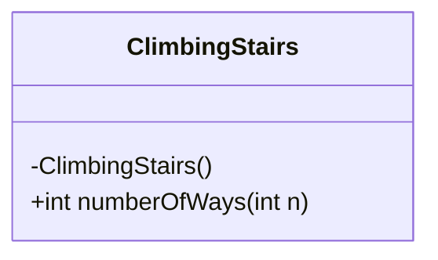
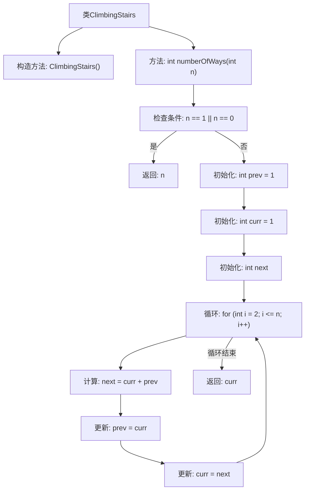

# 基础信息

|      |      |
|------|------|
| 名称 | ClimbingStairs |
| 编码语言 | .java |
| 代码路径 | Java/src/main/java/com/thealgorithms/dynamicprogramming/ClimbingStairs.java |
| 包名 | com.thealgorithms.dynamicprogramming |
| 依赖项 | [] |
| 概述说明 | 动态规划实现计算爬n阶楼梯的不同方法数。 |

# 说明

该内容描述了如何使用动态规划方法计算爬n阶楼梯的不同方法数。动态规划是一种通过将问题分解为子问题并存储子问题的解来优化计算的技术。在爬楼梯问题中，每个阶梯的解依赖于前两个阶梯的解，因此可以通过迭代或递归的方式逐步计算，最终得到爬n阶楼梯的总方法数。这种方法避免了重复计算，提高了效率。

# 类列表 Class Summary

| 名称   | 类型  | 说明 |
|-------|------|-------------|
| ClimbingStairs | class | 计算爬n阶楼梯的不同方法数，使用动态规划实现。 |

## 类 ClimbingStairs

|      |      |
|------|------|
| 访问范围 | public final |
| 类型 | class |
| 名称 | ClimbingStairs |
| 说明 | 计算爬n阶楼梯的不同方法数，使用动态规划实现。 |

### UML类图

**描述：**
`ClimbingStairs` 类是一个工具类，用于计算爬楼梯的不同方式数。它包含一个私有构造函数，防止类被实例化。`numberOfWays` 方法接受一个非负整数 `n`，表示楼梯的台阶数，并返回爬到第 `n` 阶的不同方式数。该方法通过动态规划的方式计算，使用 `prev` 和 `curr` 变量来存储前两个台阶的方式数，并通过循环逐步计算到第 `n` 阶的方式数。

### 内部方法调用关系图

这段代码实现了一个计算爬楼梯不同方式数量的算法。类`ClimbingStairs`包含一个私有构造方法和一个静态方法`numberOfWays`。该方法通过动态规划的方式，从第2步开始逐步计算每一步的爬法数量，最终返回第n步的爬法数量。流程图展示了方法的执行流程，包括条件检查、初始化和循环计算等步骤。

### 字段列表 Field List

| 名称  | 类型  | 说明 |
|-------|-------|------|

### 方法列表 Method List

| 名称  | 类型  | 说明 |
|-------|-------|------|
| numberOfWays | int | 计算到达第n步的走法总数，使用动态规划。 |

