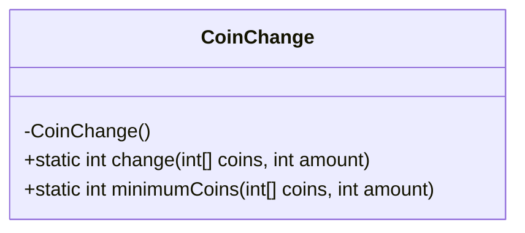
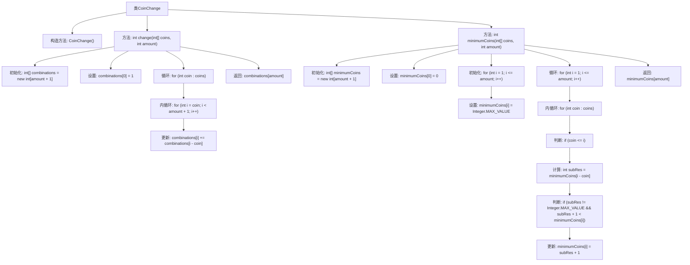

# 基础信息

|      |      |
|------|------|
| 名称 | CoinChange |
| 编码语言 | .java |
| 代码路径 | Java/src/main/java/com/thealgorithms/dynamicprogramming/CoinChange.java |
| 包名 | com.thealgorithms.dynamicprogramming |
| 依赖项 | [] |
| 概述说明 | CoinChange类提供计算硬币组合数和最小硬币数的方法。 |

# 说明

CoinChange类包含两种主要方法：第一种方法用于计算给定金额的硬币组合数，即确定有多少种不同的硬币组合可以达到该金额；第二种方法用于计算达到给定金额所需的最小硬币数，即找出最少的硬币数量来凑成该金额。这两种方法帮助用户高效地解决与硬币组合相关的计算问题。

# 类列表 Class Summary

| 名称   | 类型  | 说明 |
|-------|------|-------------|
| CoinChange | class | CoinChange类提供两种方法：计算给定金额的硬币组合数和最小硬币数。 |

## 类 CoinChange

|      |      |
|------|------|
| 访问范围 | public final |
| 类型 | class |
| 名称 | CoinChange |
| 说明 | CoinChange类提供两种方法：计算给定金额的硬币组合数和最小硬币数。 |

### UML类图

**描述：**  
`CoinChange` 类是一个工具类，提供了两个静态方法来解决硬币找零问题。`change` 方法计算给定硬币面额和金额的组合数，而 `minimumCoins` 方法计算达到给定金额所需的最少硬币数。该类使用了动态规划的思想，通过数组存储中间结果，避免重复计算，从而高效地解决问题。由于 `CoinChange` 类是一个工具类，因此其构造函数被私有化，防止实例化。

### 内部方法调用关系图

这段代码定义了一个名为`CoinChange`的类，包含两个静态方法：`change`和`minimumCoins`。`change`方法用于计算给定金额和硬币列表的组合数，而`minimumCoins`方法用于计算给定金额所需的最少硬币数。`change`方法通过动态规划的方式更新组合数，而`minimumCoins`方法则通过双重循环和条件判断来更新最小硬币数。这两个方法都使用了数组来存储中间结果，并最终返回所需的值。

### 字段列表 Field List

| 名称  | 类型  | 说明 |
|-------|-------|------|

### 方法列表 Method List

| 名称  | 类型  | 说明 |
|-------|-------|------|
| change | int | 计算给定硬币组合凑成指定金额的方法数。 |
| minimumCoins | int | 计算给定硬币数组凑齐指定金额所需的最少硬币数。 |

