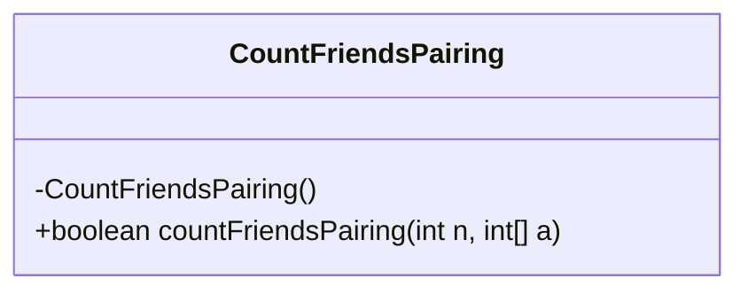
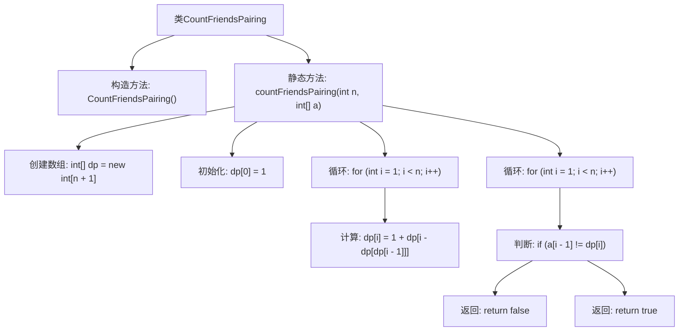

# 基础信息

|      |      |
|------|------|
| 名称 | CountFriendsPairing |
| 编码语言 | .java |
| 代码路径 | Java/src/main/java/com/thealgorithms/dynamicprogramming/CountFriendsPairing.java |
| 包名 | com.thealgorithms.dynamicprogramming |
| 依赖项 | [] |
| 概述说明 | 计算并验证朋友配对序列结果。 |

# 说明

该内容描述了一个任务，即计算朋友配对序列并验证结果是否匹配。任务的核心在于生成配对序列，并通过验证确保结果的准确性。这一过程可能涉及数据处理、算法应用和结果比对等步骤，以确保生成的配对序列符合预期要求。整个任务的目的是通过系统化的方法，确保朋友配对的合理性和有效性。

# 类列表 Class Summary

| 名称   | 类型  | 说明 |
|-------|------|-------------|
| CountFriendsPairing | class | 计算朋友配对序列并验证结果匹配。 |

## 类 CountFriendsPairing

|      |      |
|------|------|
| 访问范围 | public final |
| 类型 | class |
| 名称 | CountFriendsPairing |
| 说明 | 计算朋友配对序列并验证结果匹配。 |

### UML类图

**描述：**
`CountFriendsPairing` 是一个不可被继承的类，包含一个私有的构造函数和一个公有的静态方法 `countFriendsPairing`。该方法接受一个整数 `n` 和一个整数数组 `a` 作为参数，通过动态规划计算 Golomb 序列，并检查计算结果是否与预期值匹配。如果匹配，则返回 `true`，否则返回 `false`。

### 内部方法调用关系图

这段代码定义了一个名为 `CountFriendsPairing` 的类，其中包含一个静态方法 `countFriendsPairing`。该方法通过动态规划计算一个序列的值，并与给定的数组进行比较，如果计算结果与预期值一致，则返回 `true`，否则返回 `false`。代码的核心在于使用递推公式计算序列值，并通过循环验证结果的正确性。

### 字段列表 Field List

| 名称  | 类型  | 说明 |
|-------|-------|------|

### 方法列表 Method List

| 名称  | 类型  | 说明 |
|-------|-------|------|
| countFriendsPairing | boolean | 该方法计算Golomb序列并验证与预期结果是否匹配。 |

