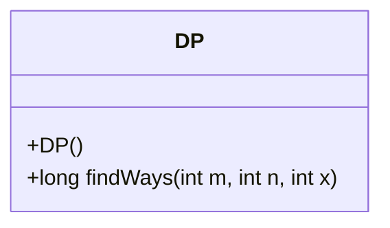
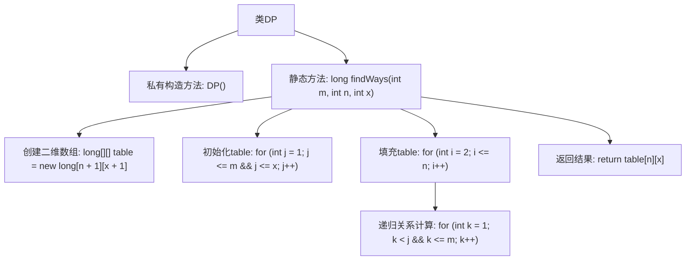

# 基础信息

|      |      |
|------|------|
| 名称 | DiceThrow |
| 编码语言 | .java |
| 代码路径 | Java/src/main/java/com/thealgorithms/dynamicprogramming/DiceThrow.java |
| 包名 | com.thealgorithms.dynamicprogramming |
| 依赖项 | [] |
| 概述说明 | 动态规划计算n个m面骰子得到和为x的方案数。 |

# 说明

动态规划用于求解n个m面骰子得到和为x的方法数。该方法通过构建一个二维数组，其中行表示骰子数量，列表示可能的总和。初始化时，第一个骰子的所有可能结果对应的方法数为1。对于每个骰子，遍历所有可能的总和，并累加前一个骰子能够达到当前总和减去当前骰子面数的方法数。最终，数组的最后一个元素即为n个m面骰子得到和为x的方法数。该方法有效避免了重复计算，提高了效率。

# 类列表 Class Summary

| 名称   | 类型  | 说明 |
|-------|------|-------------|
| DP | class | 动态规划求解n个m面骰子得到和为x的方法数。 |

## 类 DP

|      |      |
|------|------|
| 访问范围 | final |
| 类型 | class |
| 名称 | DP |
| 说明 | 动态规划求解n个m面骰子得到和为x的方法数。 |

### UML类图

这段代码定义了一个名为 `DP` 的类，该类包含一个私有的构造函数和一个公有的静态方法 `findWays`。`findWays` 方法用于计算使用 `n` 个骰子，每个骰子有 `m` 个面，得到总和为 `x` 的所有可能方式的数量。该方法通过动态规划的方式，使用一个二维数组 `table` 来存储子问题的结果，最终返回 `table[n][x]` 作为结果。由于 `DP` 类的构造函数是私有的，因此该类不能被实例化，`findWays` 方法只能通过类名直接调用。

### 内部方法调用关系图

这段代码实现了一个动态规划算法，用于计算使用`n`个骰子，每个骰子有`m`个面，得到总和为`x`的方式数。首先，代码初始化一个二维数组`table`来存储子问题的结果。然后，通过递归关系填充`table`，最终返回`table[n][x]`作为结果。流程图清晰地展示了从类定义到方法调用的各个步骤，以及内部循环和递归关系的处理过程。

### 字段列表 Field List

| 名称  | 类型  | 说明 |
|-------|-------|------|

### 方法列表 Method List

| 名称  | 类型  | 说明 |
|-------|-------|------|
| findWays | long | 动态规划求解骰子组合数。 |

