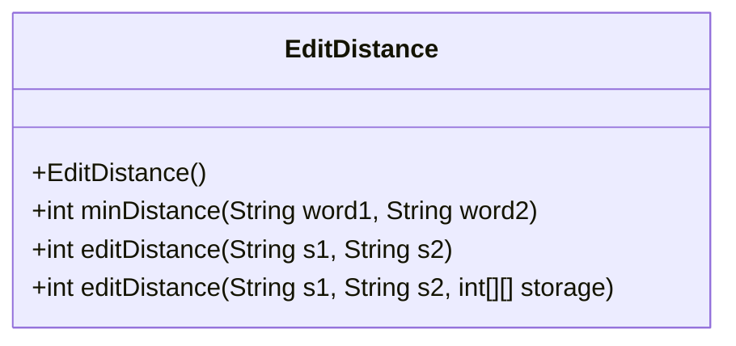
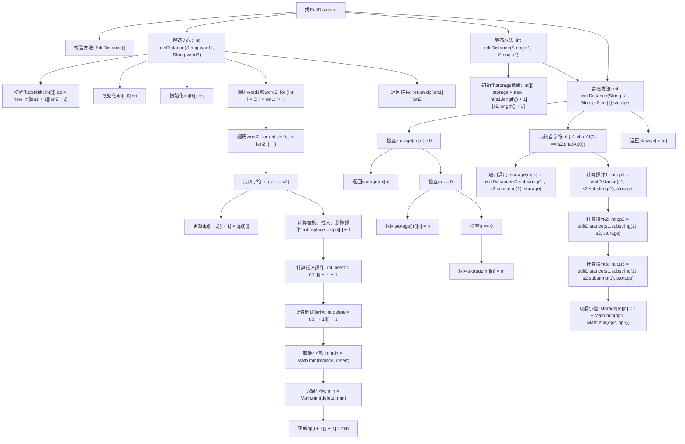

# 基础信息

|      |      |
|------|------|
| 名称 | EditDistance |
| 编码语言 | .java |
| 代码路径 | Java/src/main/java/com/thealgorithms/dynamicprogramming/EditDistance.java |
| 包名 | com.thealgorithms.dynamicprogramming |
| 依赖项 | [] |
| 概述说明 | 计算字符串编辑距离，支持插入、删除和替换操作。 |

# 说明

计算两个字符串的编辑距离，衡量将一个字符串转换为另一个字符串所需的最少操作次数。支持的操作包括插入字符、删除字符和替换字符。编辑距离越小，表示两个字符串越相似。该算法常用于文本相似度比较、拼写检查和自然语言处理等领域。

# 类列表 Class Summary

| 名称   | 类型  | 说明 |
|-------|------|-------------|
| EditDistance | class | 计算两个字符串的编辑距离，支持插入、删除和替换操作。 |

## 类 EditDistance

|      |      |
|------|------|
| 访问范围 | public final |
| 类型 | class |
| 名称 | EditDistance |
| 说明 | 计算两个字符串的编辑距离，支持插入、删除和替换操作。 |

### UML类图

**描述：**  
`EditDistance` 类是一个工具类，用于计算两个字符串之间的编辑距离。它提供了两种方法：`minDistance` 和 `editDistance`。`minDistance` 使用动态规划来计算编辑距离，而 `editDistance` 则使用递归和记忆化存储来优化计算。该类是 `final` 的，表示不能被继承，并且构造函数是私有的，防止实例化。

### 内部方法调用关系图

这段代码实现了计算两个字符串之间的编辑距离（Edit Distance），即从一个字符串转换到另一个字符串所需的最少操作次数。代码包含两个主要方法：`minDistance`和`editDistance`。`minDistance`使用动态规划的方法计算编辑距离，而`editDistance`则通过递归和备忘录（storage）来优化计算过程。流程图展示了各个方法的调用关系和内部逻辑，包括初始化、遍历、比较字符、计算操作次数以及返回结果等步骤。

### 字段列表 Field List

| 名称  | 类型  | 说明 |
|-------|-------|------|

### 方法列表 Method List

| 名称  | 类型  | 说明 |
|-------|-------|------|
| minDistance | int | 计算两字符串最小编辑距离的动态规划算法。 |
| editDistance | int | 计算字符串编辑距离，使用动态规划优化存储。 |
| editDistance | int | 计算字符串s1和s2的编辑距离，使用二维数组存储中间结果。 |

