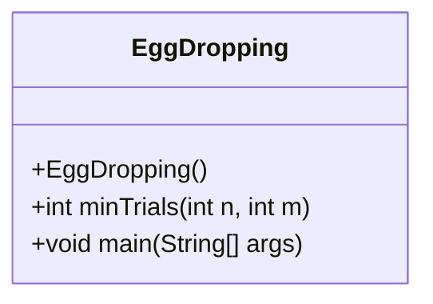
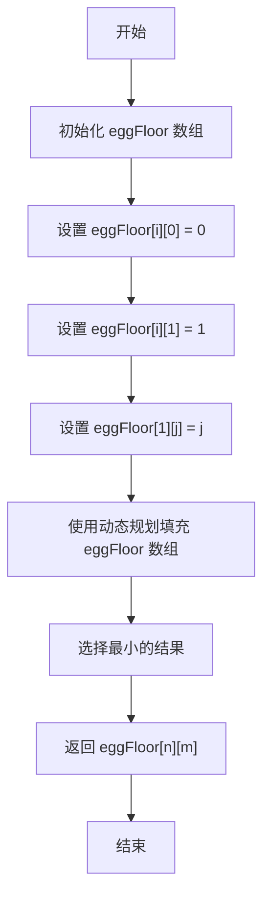
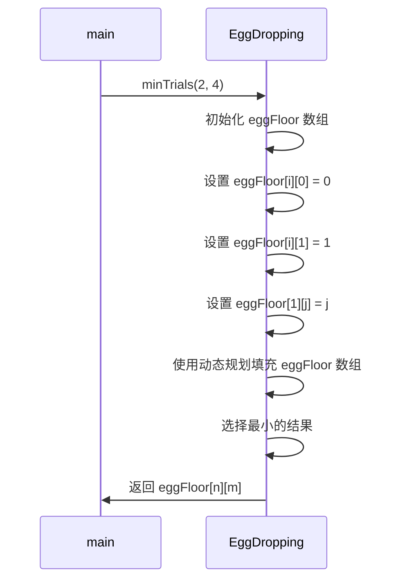
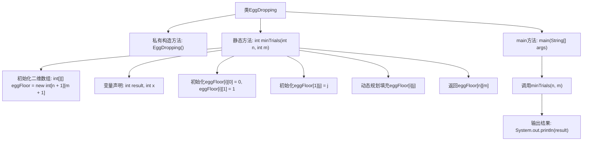

# 基础信息

|      |      |
|------|------|
| 名称 | EggDropping |
| 编码语言 | .java |
| 代码路径 | Java/src/main/java/com/thealgorithms/dynamicprogramming/EggDropping.java |
| 包名 | com.thealgorithms.dynamicprogramming |
| 依赖项 | [] |
| 概述说明 | EggDropping类用动态规划计算n蛋m楼最小试验次数。 |

# 说明

EggDropping类使用动态规划方法，计算在给定n个鸡蛋和m层楼的情况下，确定最小试验次数的算法。该方法通过构建一个二维表，逐步填充每个子问题的解，最终得出在最坏情况下所需的最少试验次数，以确保找到鸡蛋从哪一层楼开始摔碎的关键楼层。

# 类列表 Class Summary

| 名称   | 类型  | 说明 |
|-------|------|-------------|
| EggDropping | class | EggDropping类通过动态规划计算n个鸡蛋和m层楼的最小试验次数。 |

## 类 EggDropping

|      |      |
|------|------|
| 访问范围 | public final |
| 类型 | class |
| 名称 | EggDropping |
| 说明 | EggDropping类通过动态规划计算n个鸡蛋和m层楼的最小试验次数。 |

### UML类图

**描述：**
`EggDropping` 类用于解决经典的鸡蛋掉落问题，通过动态规划方法计算在最坏情况下确定鸡蛋从哪一层楼掉下不会碎的最小试验次数。代码初始化一个二维数组 `eggFloor`，并通过自底向上的方式填充数组，最终返回在给定鸡蛋数量和楼层数下的最小试验次数。

### 内部方法调用关系图

这段代码实现了一个经典的“鸡蛋掉落”问题，使用动态规划来计算在最坏情况下，给定`n`个鸡蛋和`m`层楼时，找到临界楼层所需的最少试验次数。代码通过初始化一个二维数组`eggFloor`，并使用动态规划的方法逐步填充该数组，最终返回`eggFloor[n][m]`作为结果。`main`方法中调用`minTrials`并输出结果。

### 字段列表 Field List

| 名称  | 类型  | 说明 |
|-------|-------|------|

### 方法列表 Method List

| 名称  | 类型  | 说明 |
|-------|-------|------|
| minTrials | int | 动态规划计算鸡蛋掉落最小试验次数。 |
| main | void | 计算n个鸡蛋和m层楼在最坏情况下的最少试验次数。 |

