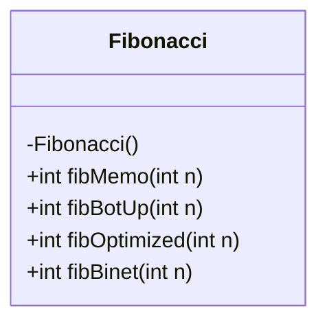
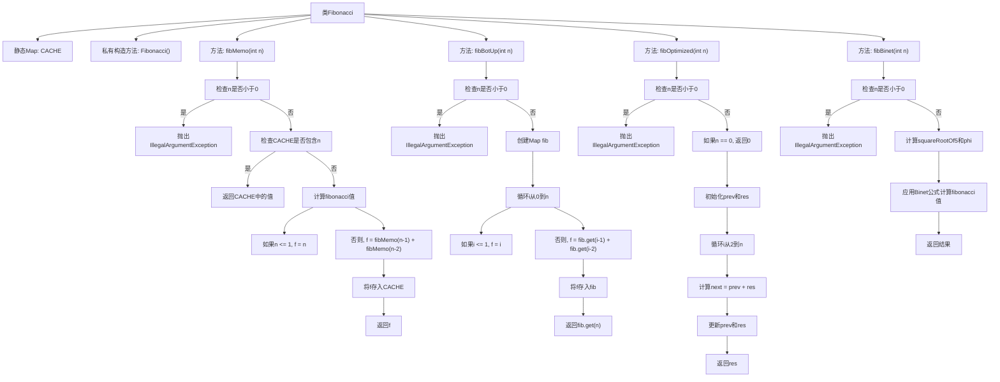

# 基础信息

|      |      |
|------|------|
| 名称 | Fibonacci |
| 编码语言 | .java |
| 代码路径 | Java/src/main/java/com/thealgorithms/dynamicprogramming/Fibonacci.java |
| 包名 | com.thealgorithms.dynamicprogramming |
| 依赖项 | ['java.util.HashMap', 'java.util.Map'] |
| 概述说明 | Fibonacci类提供四种计算第n个斐波那契数的方法。 |

# 说明

Fibonacci类提供了四种计算第n个斐波那契数的方法，包括记忆化、自底向上、优化版和Binet公式。记忆化方法通过存储已计算结果来提高效率，自底向上方法通过迭代从低到高计算，优化版进一步减少了计算复杂度，而Binet公式则利用数学公式直接计算结果。

# 类列表 Class Summary

| 名称   | 类型  | 说明 |
|-------|------|-------------|
| Fibonacci | class | Fibonacci类提供四种计算第n个斐波那契数的方法：记忆化、自底向上、优化版和Binet公式。 |

## 类 Fibonacci

|      |      |
|------|------|
| 访问范围 | public final |
| 类型 | class |
| 名称 | Fibonacci |
| 说明 | Fibonacci类提供四种计算第n个斐波那契数的方法：记忆化、自底向上、优化版和Binet公式。 |

### UML类图

**描述：**  
`Fibonacci` 类是一个工具类，提供了四种不同的方法来计算第 n 个斐波那契数。这些方法包括使用备忘录技术的递归方法 `fibMemo`、自底向上的动态规划方法 `fibBotUp`、优化后的迭代方法 `fibOptimized` 以及基于 Binet 公式的常数时间复杂度方法 `fibBinet`。所有方法都要求输入 n 为非负数，否则会抛出 `IllegalArgumentException`。这些方法展示了不同的算法策略和优化技巧，适用于不同的场景和需求。

### 内部方法调用关系图

这段代码定义了一个名为`Fibonacci`的类，该类包含了四种不同的方法来计算第n个斐波那契数。`fibMemo`使用记忆化技术，`fibBotUp`使用自底向上的方法，`fibOptimized`是一种优化的方法，`fibBinet`使用Binet公式进行计算。每种方法都首先检查输入n是否为负数，如果是则抛出`IllegalArgumentException`。流程图展示了每个方法的内部逻辑和调用关系，确保代码的正确性和可读性。

### 字段列表 Field List

| 名称  | 类型  | 说明 |
|-------|-------|------|
| CACHE = new HashMap<>() | Map<Integer, Integer> | 定义静态不可变哈希映射CACHE，键值均为整数。 |

### 方法列表 Method List

| 名称  | 类型  | 说明 |
|-------|-------|------|
| fibBotUp | int | 自底向上计算斐波那契数，使用HashMap存储结果。 |
| fibMemo | int | 递归计算斐波那契数，使用缓存优化性能。 |
| fibOptimized | int | 优化斐波那契数列计算，确保非负输入，循环迭代求解。 |
| fibBinet | int | 使用Binet公式计算斐波那契数列第n项，输入需非负。 |

