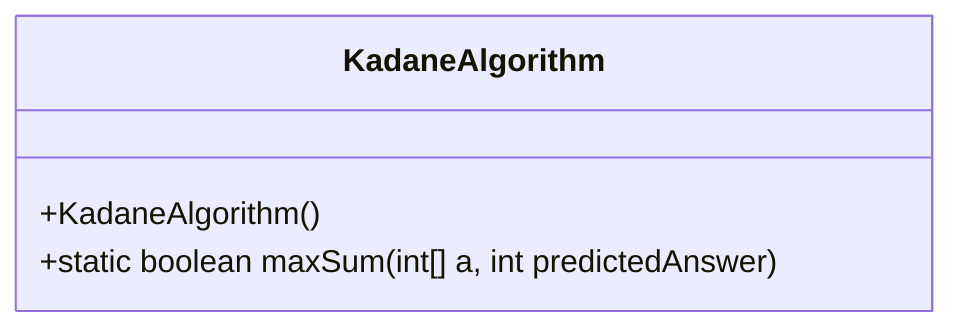
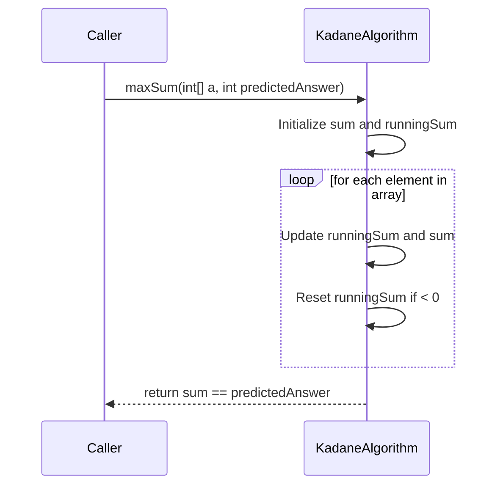
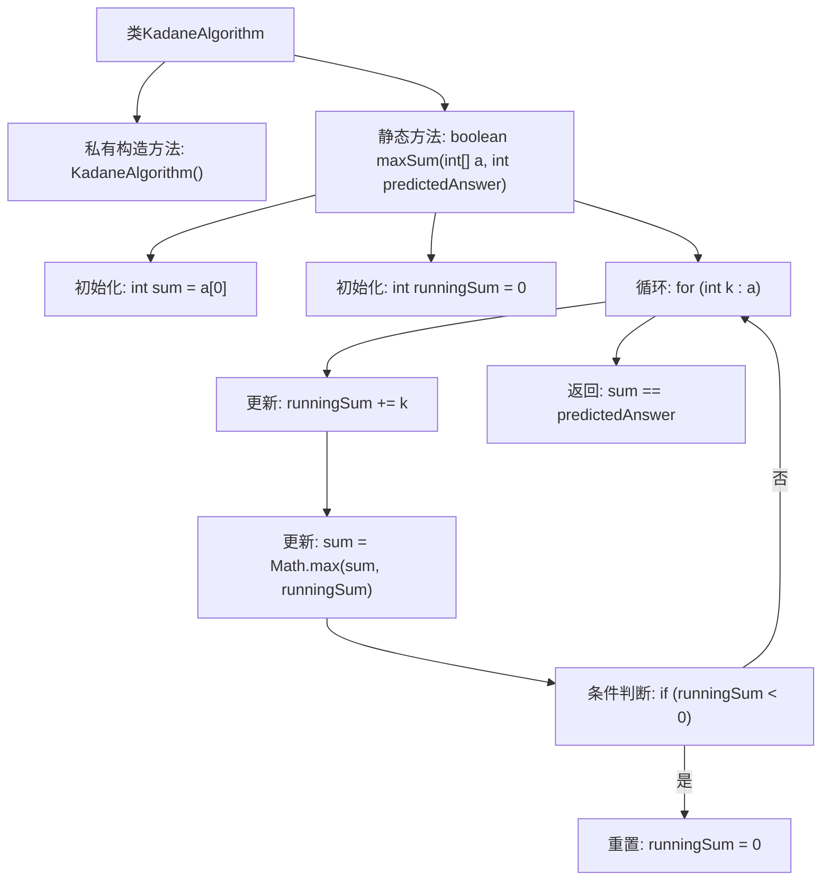

# 基础信息

|      |      |
|------|------|
| 名称 | KadaneAlgorithm |
| 编码语言 | .java |
| 代码路径 | Java/src/main/java/com/thealgorithms/dynamicprogramming/KadaneAlgorithm.java |
| 包名 | com.thealgorithms.dynamicprogramming |
| 依赖项 | [] |
| 概述说明 | Kadane算法验证最大子数组和是否符合预期。 |

# 说明

Kadane算法用于验证最大子数组和是否与预期值匹配。该算法通过遍历数组，动态计算当前子数组和，并与已知的最大和进行比较，从而确定最大子数组和。最终，算法会返回计算得到的最大和，并与预期值进行对比，以验证结果是否正确。这一过程高效且适用于各种规模的数组。

# 类列表 Class Summary

| 名称   | 类型  | 说明 |
|-------|------|-------------|
| KadaneAlgorithm | class | Kadane算法验证最大子数组和是否匹配预期值。 |

## 类 KadaneAlgorithm

|      |      |
|------|------|
| 访问范围 | public final |
| 类型 | class |
| 名称 | KadaneAlgorithm |
| 说明 | Kadane算法验证最大子数组和是否匹配预期值。 |

### UML类图

**描述：**
`KadaneAlgorithm` 类实现了 Kadane 算法，用于计算给定整数数组的最大子数组和，并验证该和是否与预测值匹配。`maxSum` 方法通过一次遍历数组，动态更新当前子数组和，并在其小于零时重置，最终返回计算和与预测值的比较结果。该算法的时间复杂度为 O(n)，空间复杂度为 O(1)。

### 内部方法调用关系图

**描述：**  
该流程图展示了KadaneAlgorithm类的结构和maxSum方法的执行流程。KadaneAlgorithm类包含一个私有构造方法和一个静态方法maxSum。maxSum方法通过遍历数组，计算最大子数组和，并与预测答案进行比较。流程图详细描述了初始化、循环、条件判断和返回结果的步骤，清晰地展示了算法的执行过程。

### 字段列表 Field List

| 名称  | 类型  | 说明 |
|-------|-------|------|

### 方法列表 Method List

| 名称  | 类型  | 说明 |
|-------|-------|------|
| maxSum | boolean | 该方法计算数组最大子数组和，并与预测值比较返回结果。 |

