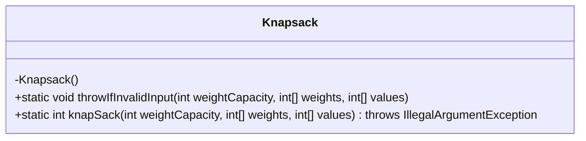
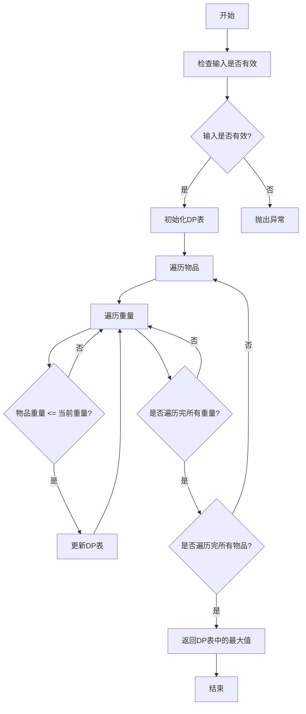
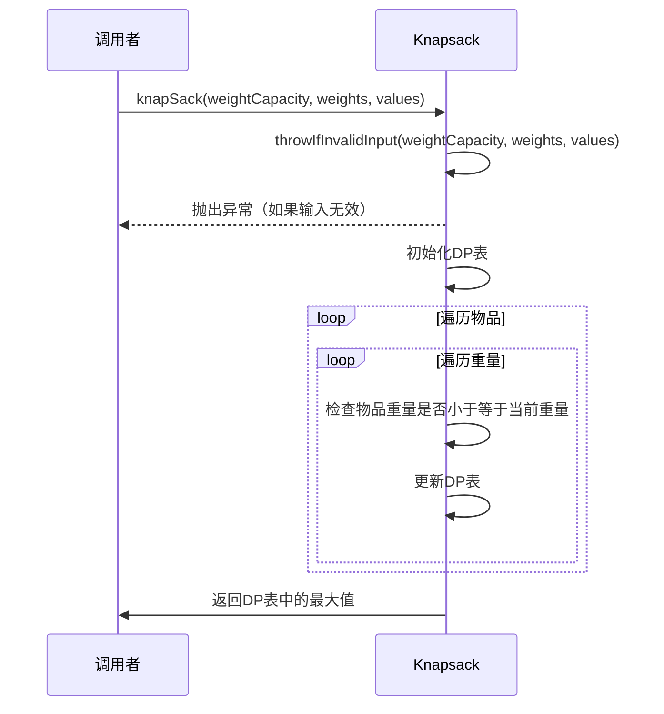
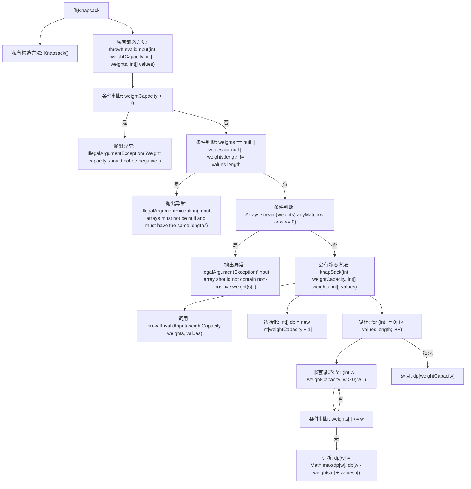

# 基础信息

|      |      |
|------|------|
| 名称 | Knapsack |
| 编码语言 | .java |
| 代码路径 | Java/src/main/java/com/thealgorithms/dynamicprogramming/Knapsack.java |
| 包名 | com.thealgorithms.dynamicprogramming |
| 依赖项 | ['java.util.Arrays'] |
| 概述说明 | Knapsack类用动态规划解决0-1背包问题，验证输入并计算最大价值。 |

# 说明

Knapsack类采用动态规划方法来解决0-1背包问题。该类首先对输入数据进行验证，确保其符合要求，然后通过动态规划算法计算出在给定背包容量下能够获得的最大价值。这一过程确保了问题的高效解决和结果的准确性。

# 类列表 Class Summary

| 名称   | 类型  | 说明 |
|-------|------|-------------|
| Knapsack | class | Knapsack类通过动态规划解决0-1背包问题，验证输入后计算最大价值。 |

## 类 Knapsack

|      |      |
|------|------|
| 访问范围 | public final |
| 类型 | class |
| 名称 | Knapsack |
| 说明 | Knapsack类通过动态规划解决0-1背包问题，验证输入后计算最大价值。 |

### UML类图

**描述：**  
`Knapsack` 类是一个用于解决0-1背包问题的工具类，提供了静态方法 `knapSack` 来计算在给定重量限制下能够获得的最大价值。该类通过动态规划方法实现，首先验证输入的有效性，然后使用二维DP表来存储中间结果，最终返回最大价值。流程图展示了从输入验证到最终结果返回的完整过程，时序图则展示了调用者与 `Knapsack` 类之间的交互。

### 内部方法调用关系图

**描述：**  
该代码实现了一个解决0-1背包问题的动态规划算法。`Knapsack`类包含一个私有构造方法和两个静态方法。`throwIfInvalidInput`方法用于验证输入参数的合法性，若输入不合法则抛出异常。`knapSack`方法通过动态规划表`dp`来计算在给定重量容量下能够获得的最大价值。流程图中详细展示了方法的调用顺序和条件判断逻辑，确保算法的正确执行。

### 字段列表 Field List

| 名称  | 类型  | 说明 |
|-------|-------|------|

### 方法列表 Method List

| 名称  | 类型  | 说明 |
|-------|-------|------|
| knapSack | int | 动态规划实现背包问题，计算最大价值。 |
| throwIfInvalidInput | void | 检查输入有效性：容量非负，数组非空且等长，权重为正。 |

