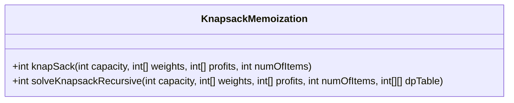
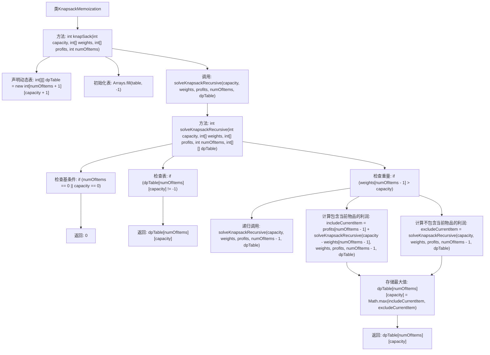

# 基础信息

|      |      |
|------|------|
| 名称 | KnapsackMemoization |
| 编码语言 | .java |
| 代码路径 | Java/src/main/java/com/thealgorithms/dynamicprogramming/KnapsackMemoization.java |
| 包名 | com.thealgorithms.dynamicprogramming |
| 依赖项 | ['java.util.Arrays'] |
| 概述说明 | 动态规划优化背包问题，递归求最大利润，记忆化提升效率。 |

# 说明

动态规划用于解决背包问题，通过递归方法计算最大利润。为了提高效率，采用记忆化技术优化递归过程，避免重复计算，从而显著提升算法性能。

# 类列表 Class Summary

| 名称   | 类型  | 说明 |
|-------|------|-------------|
| KnapsackMemoization | class | 动态规划解决背包问题，递归计算最大利润，使用记忆化优化。 |

## 类 KnapsackMemoization

|      |      |
|------|------|
| 访问范围 | public |
| 类型 | class |
| 名称 | KnapsackMemoization |
| 说明 | 动态规划解决背包问题，递归计算最大利润，使用记忆化优化。 |

### UML类图

**描述：**  
`KnapsackMemoization` 类实现了使用记忆化技术的0-1背包问题解决方案。`knapSack` 方法初始化动态规划表并调用递归方法 `solveKnapsackRecursive` 来计算最大利润。`solveKnapsackRecursive` 方法通过递归和记忆化技术，避免重复计算，提高了算法效率。该方法在每次递归调用中，根据物品的重量和背包的剩余容量，决定是否将当前物品放入背包，并更新动态规划表以存储中间结果。

### 内部方法调用关系图

这段代码实现了一个使用备忘录技术解决0-1背包问题的算法。`knapSack`方法初始化了一个动态规划表，并调用递归方法`solveKnapsackRecursive`来填充该表。递归方法通过检查基条件、表值和物品重量来决定是否包含当前物品，并最终返回最大利润。该算法通过避免重复计算，提高了效率。

### 字段列表 Field List

| 名称  | 类型  | 说明 |
|-------|-------|------|

### 方法列表 Method List

| 名称  | 类型  | 说明 |
|-------|-------|------|
| solveKnapsackRecursive | int | 递归解决背包问题，使用动态规划表优化存储。 |
| knapSack | int | 动态规划解决背包问题，初始化表并递归求解。 |

