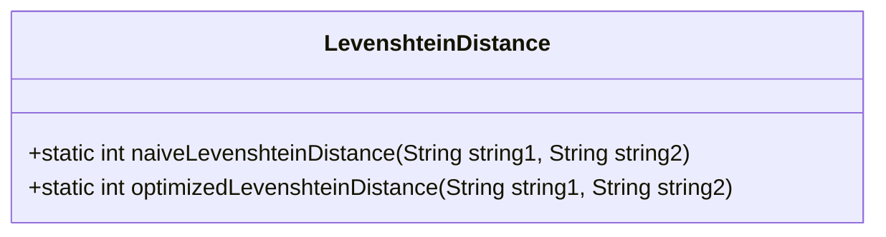
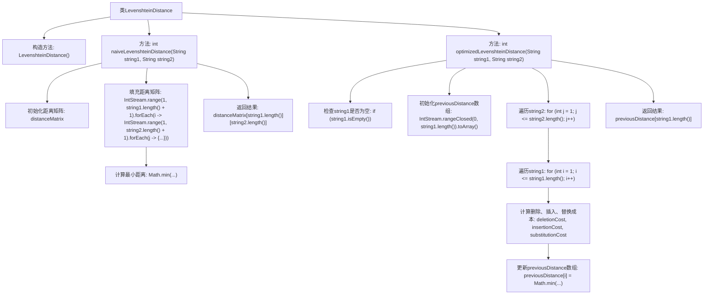

# 基础信息

|      |      |
|------|------|
| 名称 | LevenshteinDistance |
| 编码语言 | .java |
| 代码路径 | Java/src/main/java/com/thealgorithms/dynamicprogramming/LevenshteinDistance.java |
| 包名 | com.thealgorithms.dynamicprogramming |
| 依赖项 | ['java.util.stream.IntStream'] |
| 概述说明 | Levenshtein距离类，含朴素和优化动态规划实现，计算字符串编辑距离，时间复杂度O(nm)，空间复杂度O(nm)和O(n)。 |

# 说明

Levenshtein距离类提供了两种动态规划实现，用于计算字符串之间的编辑距离。第一种是朴素实现，其时间复杂度和空间复杂度均为O(nm)，其中n和m分别为两个字符串的长度。第二种是优化实现，其时间复杂度仍为O(nm)，但空间复杂度优化为O(n)，显著减少了内存占用。这两种实现均能有效计算字符串的编辑距离，适用于不同场景下的需求。

# 类列表 Class Summary

| 名称   | 类型  | 说明 |
|-------|------|-------------|
| LevenshteinDistance | class | Levenshtein距离类，包含朴素和优化两种动态规划实现，分别计算字符串编辑距离，时间复杂度均为O(nm)，空间复杂度分别为O(nm)和O(n)。 |

## 类 LevenshteinDistance

|      |      |
|------|------|
| 访问范围 | public final |
| 类型 | class |
| 名称 | LevenshteinDistance |
| 说明 | Levenshtein距离类，包含朴素和优化两种动态规划实现，分别计算字符串编辑距离，时间复杂度均为O(nm)，空间复杂度分别为O(nm)和O(n)。 |

### UML类图

**描述：**  
`LevenshteinDistance` 类提供了两种计算两个字符串之间编辑距离的方法：`naiveLevenshteinDistance` 和 `optimizedLevenshteinDistance`。`naiveLevenshteinDistance` 使用传统的动态规划方法，时间复杂度为 O(nm)，空间复杂度为 O(nm)。而 `optimizedLevenshteinDistance` 通过优化空间复杂度，将空间复杂度降低到 O(n)，同时保持相同的时间复杂度。该类是一个工具类，不能被实例化，所有方法均为静态方法。

### 内部方法调用关系图

**描述：**  
该代码实现了计算两个字符串之间的Levenshtein距离的两种方法：`naiveLevenshteinDistance`和`optimizedLevenshteinDistance`。`naiveLevenshteinDistance`使用动态规划矩阵来存储中间结果，时间复杂度为O(nm)，空间复杂度为O(nm)。`optimizedLevenshteinDistance`通过优化空间复杂度，仅使用一维数组来存储中间结果，时间复杂度仍为O(nm)，但空间复杂度降低为O(n)。两种方法都通过遍历字符串并计算插入、删除、替换的成本来最终确定最小编辑距离。

### 字段列表 Field List

| 名称  | 类型  | 说明 |
|-------|-------|------|

### 方法列表 Method List

| 名称  | 类型  | 说明 |
|-------|-------|------|
| naiveLevenshteinDistance | int | 计算两个字符串的编辑距离，返回最小操作次数。 |
| optimizedLevenshteinDistance | int | 优化计算字符串间编辑距离的算法。 |

