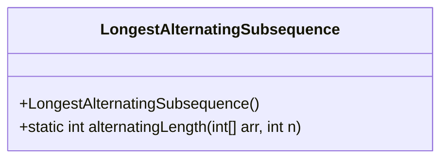
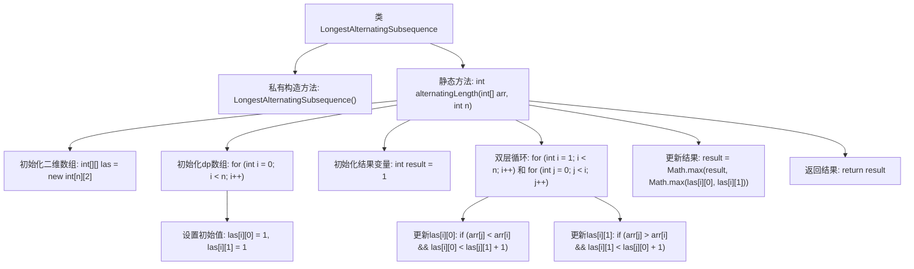

# 基础信息

|      |      |
|------|------|
| 名称 | LongestAlternatingSubsequence |
| 编码语言 | .java |
| 代码路径 | Java/src/main/java/com/thealgorithms/dynamicprogramming/LongestAlternatingSubsequence.java |
| 包名 | com.thealgorithms.dynamicprogramming |
| 依赖项 | [] |
| 概述说明 | 动态规划求解最长交替子序列长度。 |

# 说明

动态规划是一种用于求解最长交替子序列长度的有效方法。交替子序列是指序列中相邻元素交替增大或减小的子序列。通过动态规划，可以构建状态转移方程，记录每个位置作为交替子序列结尾时的最大长度。具体步骤包括初始化状态数组，遍历序列，根据当前元素与前一个元素的大小关系更新状态值，最终得到整个序列的最长交替子序列长度。该方法时间复杂度为O(n)，空间复杂度为O(n)，适用于处理大规模序列问题。

# 类列表 Class Summary

| 名称   | 类型  | 说明 |
|-------|------|-------------|
| LongestAlternatingSubsequence | class | 动态规划求最长交替子序列长度。 |

## 类 LongestAlternatingSubsequence

|      |      |
|------|------|
| 访问范围 | public final |
| 类型 | class |
| 名称 | LongestAlternatingSubsequence |
| 说明 | 动态规划求最长交替子序列长度。 |

### UML类图

**描述：**  
`LongestAlternatingSubsequence` 是一个不可继承的类，包含一个私有的构造函数和一个静态方法 `alternatingLength`。该方法用于计算给定整数数组中最长交替子序列的长度。方法使用动态规划技术，通过维护一个二维数组 `las` 来记录以每个索引结尾的最长交替子序列的长度。最终返回的是 `las` 数组中的最大值。

### 内部方法调用关系图

这段代码实现了一个名为`LongestAlternatingSubsequence`的类，其中包含一个静态方法`alternatingLength`，用于计算给定整数数组中最长交替子序列的长度。该方法使用动态规划，通过维护一个二维数组`las`来记录在每个位置结束的最长交替子序列的长度。代码通过双层循环遍历数组，并根据当前元素与前一个元素的大小关系更新`las`数组。最终，方法返回`las`数组中的最大值作为结果。

### 字段列表 Field List

| 名称  | 类型  | 说明 |
|-------|-------|------|

### 方法列表 Method List

| 名称  | 类型  | 说明 |
|-------|-------|------|
| alternatingLength | int | 动态规划求解最长交替子序列长度。 |

