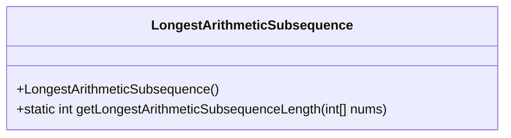
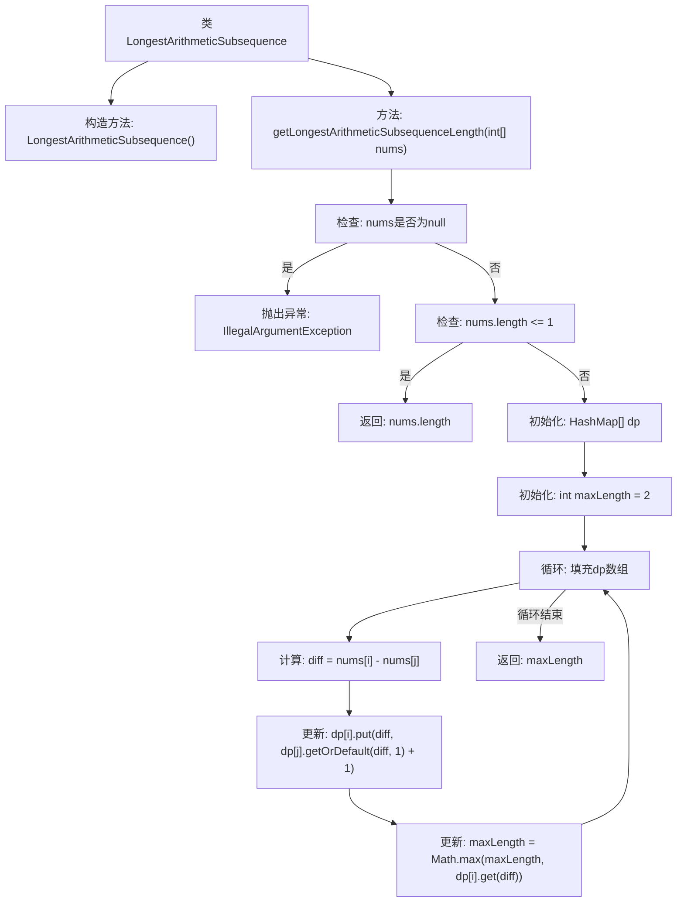

# 基础信息

|      |      |
|------|------|
| 名称 | LongestArithmeticSubsequence |
| 编码语言 | .java |
| 代码路径 | Java/src/main/java/com/thealgorithms/dynamicprogramming/LongestArithmeticSubsequence.java |
| 包名 | com.thealgorithms.dynamicprogramming |
| 依赖项 | ['java.util.HashMap'] |
| 概述说明 | 计算数组中最长等差子序列的长度。 |

# 说明

查找数组中最长等差子序列的长度，要求确定数组中元素之间的差值相同且最长的子序列。等差子序列是指序列中相邻元素之间的差值相等。需要遍历数组，计算每对元素之间的差值，并记录最长的等差子序列长度。最终返回该长度作为结果。

# 类列表 Class Summary

| 名称   | 类型  | 说明 |
|-------|------|-------------|
| LongestArithmeticSubsequence | class | 查找数组中最长等差子序列的长度。 |

## 类 LongestArithmeticSubsequence

|      |      |
|------|------|
| 访问范围 | final |
| 类型 | class |
| 名称 | LongestArithmeticSubsequence |
| 说明 | 查找数组中最长等差子序列的长度。 |

### UML类图

这段代码定义了一个名为 `LongestArithmeticSubsequence` 的最终类，该类包含一个私有的构造函数和一个静态方法 `getLongestArithmeticSubsequenceLength`。该方法用于计算给定整数数组中最长算术子序列的长度。算术子序列是指序列中相邻元素之间的差值相同。该方法通过动态规划的方式，使用一个 `HashMap` 数组来存储每个位置的可能差值及其对应的子序列长度，最终返回最长的算术子序列长度。

### 内部方法调用关系图

这段代码用于计算给定整数数组中最长算术子序列的长度。算术子序列是指序列中相邻元素之间的差值相同。代码首先检查输入数组的有效性，然后使用动态规划的方法计算每个可能的差值，并更新最大长度。最终返回找到的最长算术子序列的长度。

### 字段列表 Field List

| 名称  | 类型  | 说明 |
|-------|-------|------|

### 方法列表 Method List

| 名称  | 类型  | 说明 |
|-------|-------|------|
| getLongestArithmeticSubsequenceLength | int | 计算数组中最长等差数列的长度，使用动态规划实现。 |

