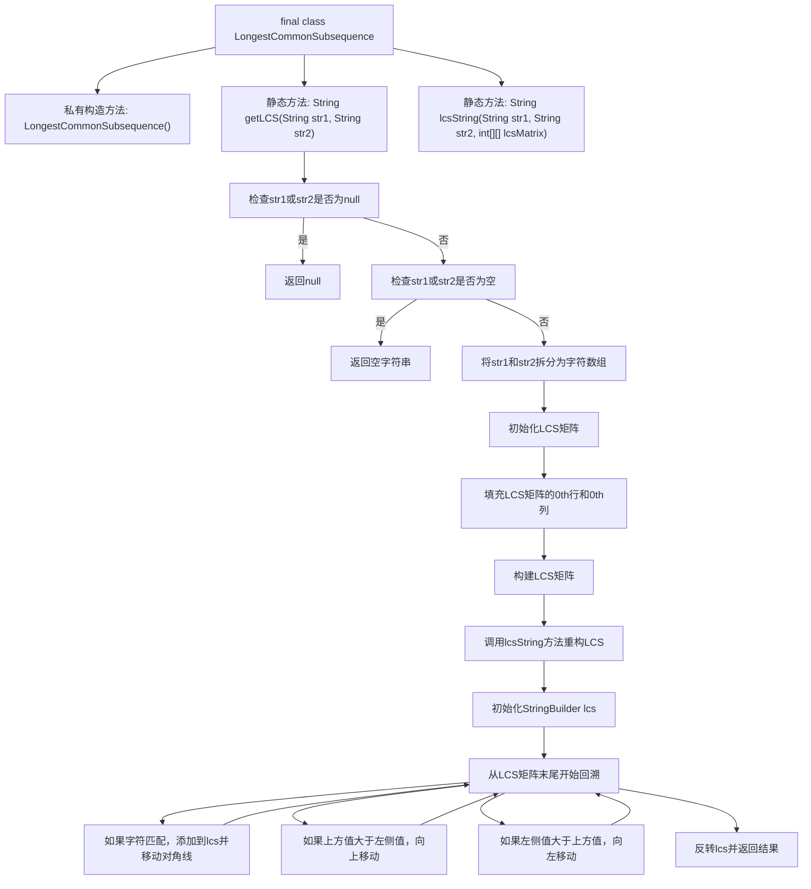

# 基础信息

|      |      |
|------|------|
| 名称 | LongestCommonSubsequence |
| 编码语言 | .java |
| 代码路径 | Java/src/main/java/com/thealgorithms/dynamicprogramming/LongestCommonSubsequence.java |
| 包名 | com.thealgorithms.dynamicprogramming |
| 依赖项 | [] |
| 概述说明 | 计算两字符串的最长公共子序列。 |

# 说明

该任务要求计算两个字符串的最长公共子序列。最长公共子序列是指在两个字符串中都出现的最长子序列，子序列中的字符顺序与原始字符串中的顺序一致，但不要求连续。解决此问题通常涉及动态规划方法，通过构建一个二维表格来记录子问题的解，从而逐步推导出最终结果。此方法能有效处理字符串长度较大的情况，确保计算的准确性和效率。

# 类列表 Class Summary

| 名称   | 类型  | 说明 |
|-------|------|-------------|
| LongestCommonSubsequence | class | 计算两个字符串的最长公共子序列。 |

## 类 LongestCommonSubsequence

|      |      |
|------|------|
| 访问范围 | final |
| 类型 | class |
| 名称 | LongestCommonSubsequence |
| 说明 | 计算两个字符串的最长公共子序列。 |

### UML类图

这段代码定义了一个名为 `LongestCommonSubsequence` 的类，该类包含两个静态方法：`getLCS` 和 `lcsString`。`getLCS` 方法用于计算两个字符串的最长公共子序列（LCS），而 `lcsString` 方法则用于从 LCS 矩阵中重建 LCS 字符串。该类的主要功能是通过动态规划的方法来解决 LCS 问题，首先构建一个 LCS 矩阵，然后通过回溯该矩阵来得到最终的 LCS 字符串。代码处理了字符串为空或为 `null` 的边缘情况，并确保计算的正确性。

### 内部方法调用关系图

这段代码实现了一个用于计算两个字符串的最长公共子序列（LCS）的类。首先，`getLCS`方法检查输入字符串是否为空或null，然后通过动态规划构建LCS矩阵。接着，`lcsString`方法从矩阵的末尾开始回溯，重构出LCS字符串。最终，返回的LCS字符串是经过反转的，以确保正确的顺序。整个流程通过矩阵填充和回溯步骤，确保高效地找到最长公共子序列。

### 字段列表 Field List

| 名称  | 类型  | 说明 |
|-------|-------|------|

### 方法列表 Method List

| 名称  | 类型  | 说明 |
|-------|-------|------|
| getLCS | String | 计算两个字符串的最长公共子序列，返回结果或空字符串。 |
| lcsString | String | 通过LCS矩阵回溯生成最长公共子序列字符串。 |

