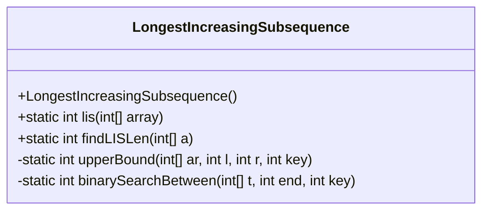
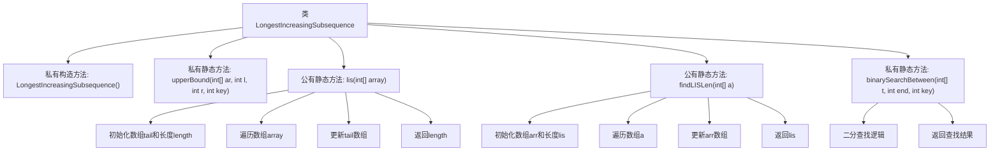

# 基础信息

|      |      |
|------|------|
| 名称 | LongestIncreasingSubsequence |
| 编码语言 | .java |
| 代码路径 | Java/src/main/java/com/thealgorithms/dynamicprogramming/LongestIncreasingSubsequence.java |
| 包名 | com.thealgorithms.dynamicprogramming |
| 依赖项 | [] |
| 概述说明 | 该代码实现最长递增子序列算法，时间复杂度为O(nlogn)。 |

# 说明

该代码实现了最长递增子序列算法，其时间复杂度为O(nlogn)。该算法通过优化传统动态规划方法，利用二分查找技术来提升效率，能够高效地找到给定序列中的最长递增子序列。这种方法在处理大规模数据时表现出色，适用于需要快速求解递增子序列的场景。

# 类列表 Class Summary

| 名称   | 类型  | 说明 |
|-------|------|-------------|
| LongestIncreasingSubsequence | class | 该代码实现最长递增子序列算法，时间复杂度为O(nlogn)。 |

## 类 LongestIncreasingSubsequence

|      |      |
|------|------|
| 访问范围 | public final |
| 类型 | class |
| 名称 | LongestIncreasingSubsequence |
| 说明 | 该代码实现最长递增子序列算法，时间复杂度为O(nlogn)。 |

### UML类图

**描述：**
`LongestIncreasingSubsequence` 类提供了计算最长递增子序列（LIS）长度的功能。它包含两个公有方法 `lis` 和 `findLISLen`，分别用于计算 LIS 的长度。这两个方法都依赖于私有的辅助方法 `upperBound` 和 `binarySearchBetween`，这些方法通过二分查找来优化查找过程，确保算法的时间复杂度为 O(n log n)。该类被设计为工具类，因此构造函数为私有，防止实例化。

### 内部方法调用关系图

这段代码实现了最长递增子序列（LIS）的算法，包含两个主要方法`lis`和`findLISLen`，分别用于计算给定数组的最长递增子序列长度。`upperBound`和`binarySearchBetween`是辅助方法，用于在二分查找中确定插入位置。代码通过维护一个`tail`或`arr`数组来存储当前的最长递增子序列，并通过二分查找优化时间复杂度至O(nlogn)。

### 字段列表 Field List

| 名称  | 类型  | 说明 |
|-------|-------|------|

### 方法列表 Method List

| 名称  | 类型  | 说明 |
|-------|-------|------|
| upperBound | int | 该方法在有序数组中查找大于等于给定键值的最小索引。 |
| findLISLen | int | 查找数组中最长递增子序列的长度。 |
| lis | int | 计算数组最长递增子序列长度的静态方法。 |
| binarySearchBetween | int | 二分查找确定key在数组t中的插入位置。 |

