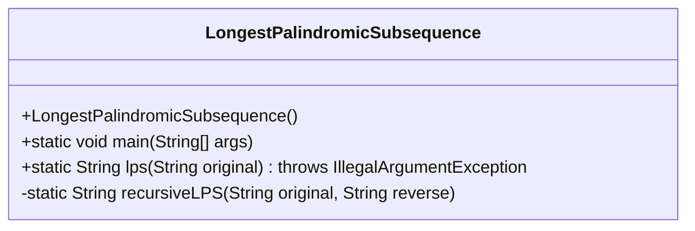
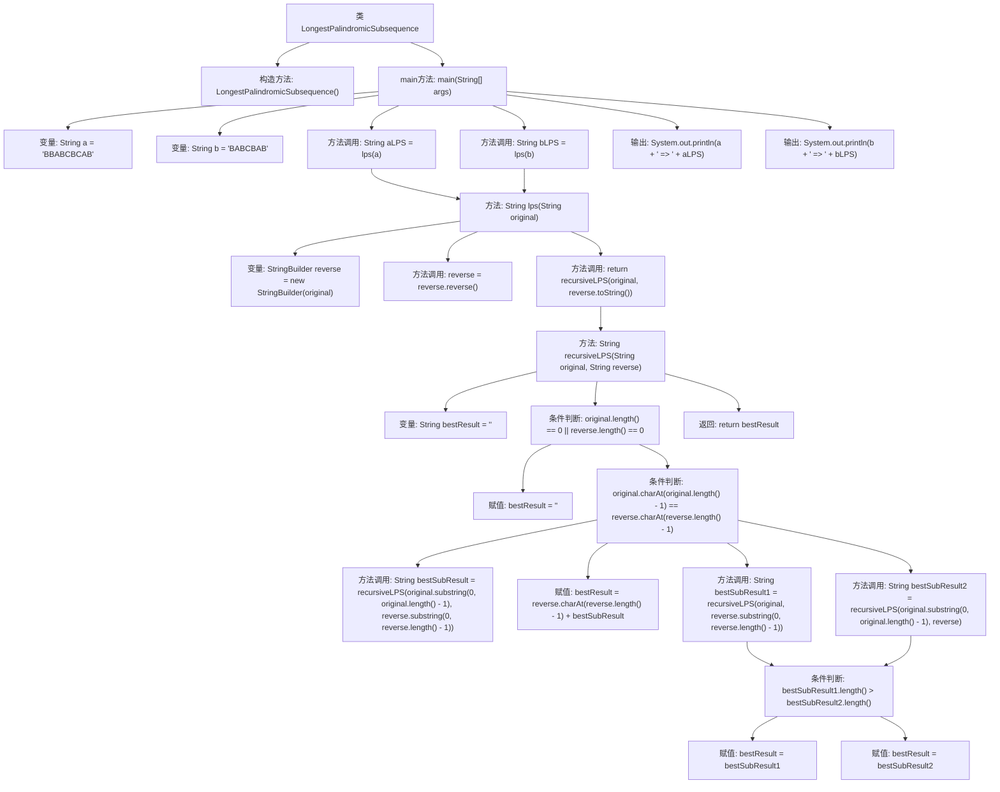

# 基础信息

|      |      |
|------|------|
| 名称 | LongestPalindromicSubsequence |
| 编码语言 | .java |
| 代码路径 | Java/src/main/java/com/thealgorithms/dynamicprogramming/LongestPalindromicSubsequence.java |
| 包名 | com.thealgorithms.dynamicprogramming |
| 依赖项 | [] |
| 概述说明 | Java类递归计算字符串最长回文子序列。 |

# 说明

该内容描述了一个Java类，其功能是计算字符串的最长回文子序列。实现方法采用递归技术，通过递归调用来逐步分解问题并找到最长回文子序列。递归方法在处理字符串时，通过比较字符并逐步缩小问题规模，最终确定最长回文子序列的长度。这种方法虽然直观，但在处理较长字符串时可能会面临性能挑战。

# 类列表 Class Summary

| 名称   | 类型  | 说明 |
|-------|------|-------------|
| LongestPalindromicSubsequence | class | Java类计算字符串的最长回文子序列，通过递归方法实现。 |

## 类 LongestPalindromicSubsequence

|      |      |
|------|------|
| 访问范围 | public final |
| 类型 | class |
| 名称 | LongestPalindromicSubsequence |
| 说明 | Java类计算字符串的最长回文子序列，通过递归方法实现。 |

### UML类图

### 描述
`LongestPalindromicSubsequence` 类是一个用于查找字符串中最长回文子序列的工具类。它包含一个私有的构造函数以防止实例化，一个 `main` 方法用于测试，以及两个静态方法 `lps` 和 `recursiveLPS`。`lps` 方法接受一个字符串并返回其最长回文子序列，而 `recursiveLPS` 是一个递归辅助方法，用于比较原始字符串和其反转字符串，逐步构建最长回文子序列。

### 内部方法调用关系图

这段代码用于寻找给定字符串的最长回文子序列（Longest Palindromic Subsequence, LPS）。通过递归方法，代码比较字符串及其反转字符串的字符，逐步构建最长回文子序列。流程图展示了从主方法到递归调用的完整流程，包括字符串的反转、字符比较以及结果的选择与返回。

### 字段列表 Field List

| 名称  | 类型  | 说明 |
|-------|-------|------|

### 方法列表 Method List

| 名称  | 类型  | 说明 |
|-------|-------|------|
| main | void | Java代码计算字符串的最长回文子序列并输出结果。 |
| recursiveLPS | String | 递归查找最长回文子串，匹配字符则递归，否则取较长结果。 |
| lps | String | 静态方法lps反转字符串并递归查找最长回文子串。 |

