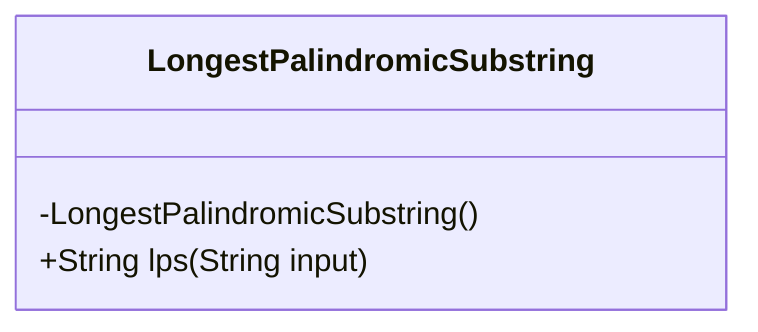
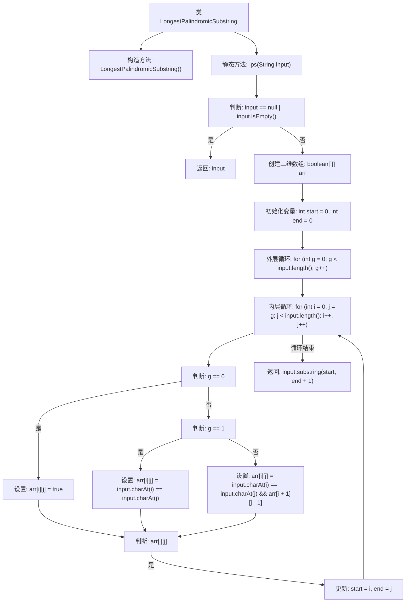

# 基础信息

|      |      |
|------|------|
| 名称 | LongestPalindromicSubstring |
| 编码语言 | .java |
| 代码路径 | Java/src/main/java/com/thealgorithms/dynamicprogramming/LongestPalindromicSubstring.java |
| 包名 | com.thealgorithms.dynamicprogramming |
| 依赖项 | [] |
| 概述说明 | 动态规划用于寻找字符串中的最长回文子串。 |

# 说明

动态规划是一种用于求解最长回文子串的有效方法。该方法通过构建一个二维数组来记录字符串中各个子串是否为回文。具体步骤包括初始化单个字符和两个相邻字符的回文状态，然后逐步扩展子串长度，通过状态转移方程判断更长的子串是否为回文。最终，通过遍历数组找到最长的回文子串。该方法的时间复杂度为O(n^2)，空间复杂度也为O(n^2)，适用于中等长度的字符串求解。

# 类列表 Class Summary

| 名称   | 类型  | 说明 |
|-------|------|-------------|
| LongestPalindromicSubstring | class | 动态规划求解最长回文子串。 |

## 类 LongestPalindromicSubstring

|      |      |
|------|------|
| 访问范围 | public final |
| 类型 | class |
| 名称 | LongestPalindromicSubstring |
| 说明 | 动态规划求解最长回文子串。 |

### UML类图

**描述：**  
`LongestPalindromicSubstring` 类是一个工具类，用于查找给定字符串中的最长回文子串。该类包含一个私有构造函数，防止实例化，以及一个公有静态方法 `lps`，该方法接受一个字符串作为输入，并返回该字符串中最长的回文子串。方法内部使用动态规划算法，通过二维布尔数组记录子串是否为回文，最终确定最长回文子串的起始和结束位置，并返回该子串。

### 内部方法调用关系图

这段代码实现了一个寻找字符串中最长回文子串的算法。通过动态规划的方法，使用一个二维布尔数组来记录子串是否为回文。外层循环控制子串的长度，内层循环遍历所有可能的子串起始位置。根据子串长度和字符匹配情况更新数组，并记录最长回文子串的起始和结束位置。最终返回找到的最长回文子串。

### 字段列表 Field List

| 名称  | 类型  | 说明 |
|-------|-------|------|

### 方法列表 Method List

| 名称  | 类型  | 说明 |
|-------|-------|------|
| lps | String | 查找字符串中最长回文子串的动态规划算法。 |

