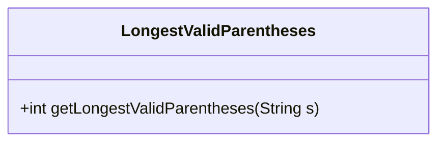
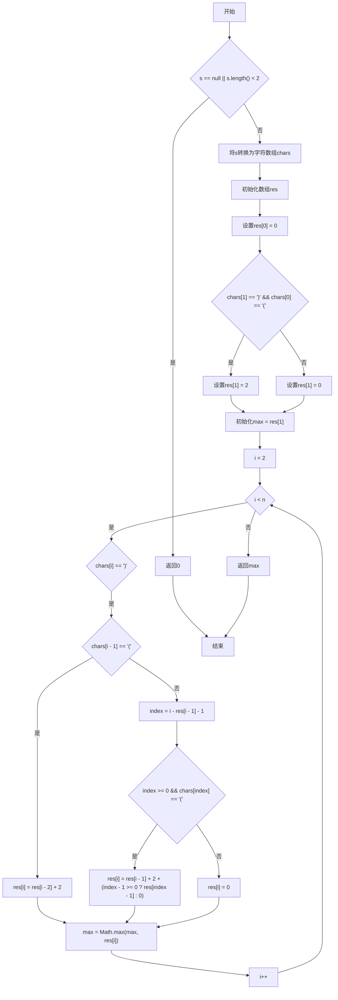
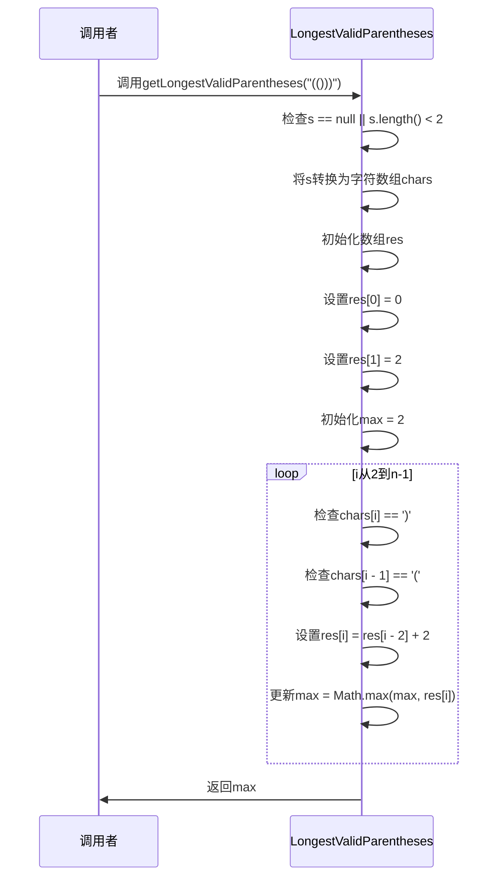
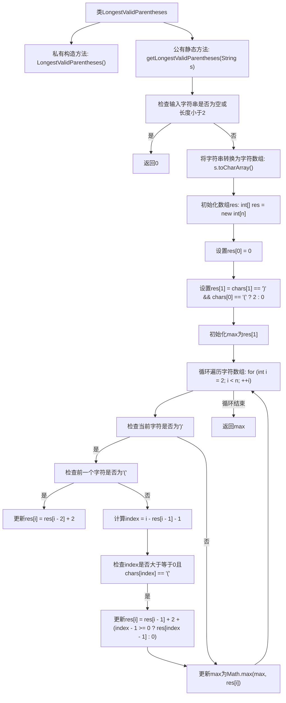

# 基础信息

|      |      |
|------|------|
| 名称 | LongestValidParentheses |
| 编码语言 | .java |
| 代码路径 | Java/src/main/java/com/thealgorithms/dynamicprogramming/LongestValidParentheses.java |
| 包名 | com.thealgorithms.dynamicprogramming |
| 依赖项 | [] |
| 概述说明 | 计算字符串中最长有效括号子串的长度。 |

# 说明

计算字符串中最长有效括号子串的长度，是指在一个由左右括号组成的字符串中，找到最长的连续子串，该子串中的括号是有效配对的。有效配对的括号子串要求每个左括号都能与一个右括号正确匹配，且括号的嵌套顺序正确。这个问题通常通过动态规划或栈的方法来解决，通过遍历字符串并记录有效括号的长度，最终得到最长有效括号子串的长度。

# 类列表 Class Summary

| 名称   | 类型  | 说明 |
|-------|------|-------------|
| LongestValidParentheses | class | 计算字符串中最长有效括号子串的长度。 |

## 类 LongestValidParentheses

|      |      |
|------|------|
| 访问范围 | public final |
| 类型 | class |
| 名称 | LongestValidParentheses |
| 说明 | 计算字符串中最长有效括号子串的长度。 |

### UML类图

**描述：**  
`LongestValidParentheses` 类包含一个静态方法 `getLongestValidParentheses`，用于计算给定字符串中最长的有效括号子串的长度。该方法首先检查输入字符串是否为空或长度小于2，如果是则返回0。然后，它将字符串转换为字符数组，并初始化一个数组 `res` 来存储每个位置的最长有效括号长度。通过遍历字符数组，根据当前字符和前一个字符的情况，更新 `res` 数组中的值，并最终返回最大值。流程图展示了该方法的执行逻辑，时序图展示了调用者与 `LongestValidParentheses` 类之间的交互过程。

### 内部方法调用关系图

这段代码实现了一个名为`LongestValidParentheses`的类，其中包含一个静态方法`getLongestValidParentheses`，用于计算给定字符串中最长有效括号子串的长度。方法首先检查输入字符串的有效性，然后通过动态规划的方式遍历字符数组，更新每个位置的有效括号长度，并最终返回最大值。流程图展示了该方法的详细执行步骤，包括输入检查、数组初始化、循环遍历、条件判断和结果更新等过程。

### 字段列表 Field List

| 名称  | 类型  | 说明 |
|-------|-------|------|

### 方法列表 Method List

| 名称  | 类型  | 说明 |
|-------|-------|------|
| getLongestValidParentheses | int | 获取字符串中最长有效括号子串的长度。 |

