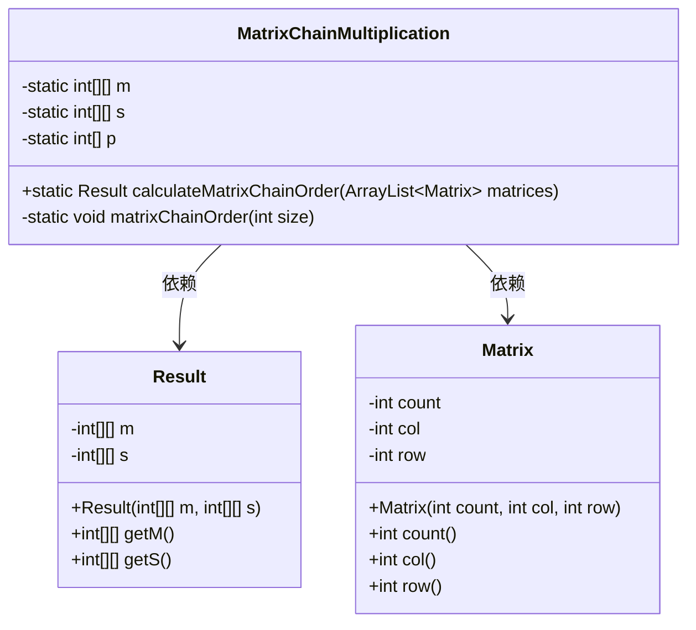
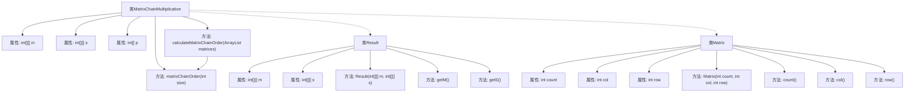

# 基础信息

|      |      |
|------|------|
| 名称 | MatrixChainMultiplication |
| 编码语言 | .java |
| 代码路径 | Java/src/main/java/com/thealgorithms/dynamicprogramming/MatrixChainMultiplication.java |
| 包名 | com.thealgorithms.dynamicprogramming |
| 依赖项 | ['java.util.ArrayList', 'java.util.Arrays'] |
| 概述说明 | 矩阵链乘法类使用动态规划计算最优乘法顺序，返回最小成本和分割点。 |

# 说明

矩阵链乘法类采用动态规划方法，旨在计算矩阵乘法的最优顺序，以最小化计算成本。该类不仅返回最小成本，还提供分割点信息，帮助确定矩阵相乘的最佳顺序。通过动态规划，类有效地解决了矩阵链乘法的优化问题，确保计算过程高效且结果准确。

# 类列表 Class Summary

| 名称   | 类型  | 说明 |
|-------|------|-------------|
| MatrixChainMultiplication | class | 矩阵链乘法类，通过动态规划计算矩阵乘法最优顺序，返回最小成本和分割点。 |

## 类 MatrixChainMultiplication

|      |      |
|------|------|
| 访问范围 | public final |
| 类型 | class |
| 名称 | MatrixChainMultiplication |
| 说明 | 矩阵链乘法类，通过动态规划计算矩阵乘法最优顺序，返回最小成本和分割点。 |

### UML类图

### 描述
`MatrixChainMultiplication` 类用于计算矩阵链乘法的最优顺序，通过动态规划方法计算最小乘法成本和最优分割点。`Result` 类用于存储计算结果，包括最小成本矩阵和最优分割点矩阵。`Matrix` 类表示矩阵的维度信息。`MatrixChainMultiplication` 依赖 `Result` 和 `Matrix` 类来完成计算和存储结果。

### 内部方法调用关系图

这段代码实现了一个矩阵链乘法的最优计算顺序。`MatrixChainMultiplication`类通过动态规划方法计算矩阵链乘法的最小成本和最优分割点。`calculateMatrixChainOrder`方法初始化并调用`matrixChainOrder`方法来计算最小成本矩阵`m`和分割点矩阵`s`。`Result`类用于存储计算结果，而`Matrix`类表示矩阵的维度和标识。整个流程通过嵌套循环和条件判断逐步计算出最优的矩阵乘法顺序。

### 字段列表 Field List

| 名称  | 类型  | 说明 |
|-------|-------|------|
| p | int[] | 定义私有静态整型数组p。 |
| m | int[][] | 声明一个私有的静态二维整型数组m。 |
| s | int[][] | 声明一个私有的静态二维整型数组s。 |

### 方法列表 Method List

| 名称  | 类型  | 说明 |
|-------|-------|------|
| calculateMatrixChainOrder | Result | 静态方法计算矩阵链乘法顺序，初始化并填充矩阵，返回结果。 |
| matrixChainOrder | void | 矩阵链乘法优化算法，计算最小乘法次数并记录分割点。 |

