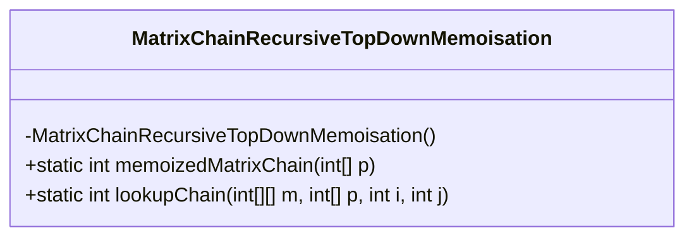
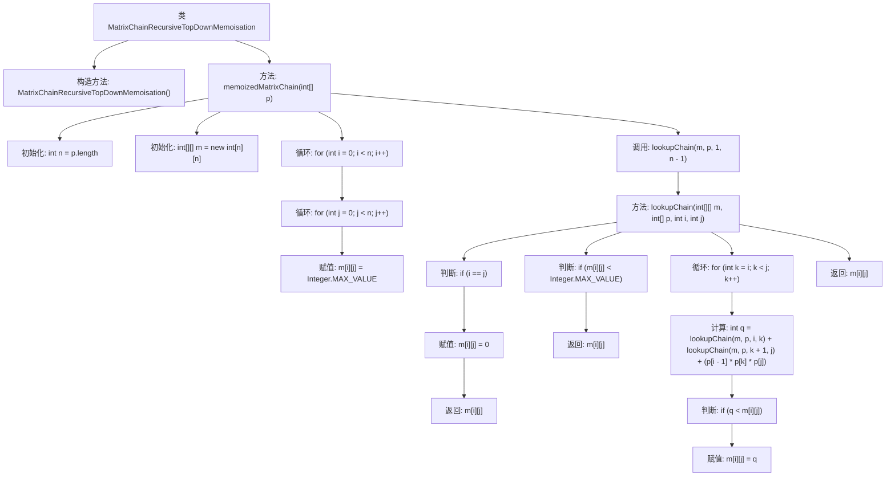

# 基础信息

|      |      |
|------|------|
| 名称 | MatrixChainRecursiveTopDownMemoisation |
| 编码语言 | .java |
| 代码路径 | Java/src/main/java/com/thealgorithms/dynamicprogramming/MatrixChainRecursiveTopDownMemoisation.java |
| 包名 | com.thealgorithms.dynamicprogramming |
| 依赖项 | [] |
| 概述说明 | 递归动态规划求解矩阵链乘法最小标量乘法次数。 |

# 说明

递归动态规划是一种用于求解矩阵链乘法问题中最小标量乘法次数的方法。该方法通过将问题分解为子问题，逐步计算每个子问题的最优解，并利用递归调用和动态规划表来存储中间结果，避免重复计算，从而高效地找到整个矩阵链乘法的最小标量乘法次数。

# 类列表 Class Summary

| 名称   | 类型  | 说明 |
|-------|------|-------------|
| MatrixChainRecursiveTopDownMemoisation | class | 递归动态规划求解矩阵链乘法最小标量乘法次数。 |

## 类 MatrixChainRecursiveTopDownMemoisation

|      |      |
|------|------|
| 访问范围 | public final |
| 类型 | class |
| 名称 | MatrixChainRecursiveTopDownMemoisation |
| 说明 | 递归动态规划求解矩阵链乘法最小标量乘法次数。 |

### UML类图

**描述：**  
`MatrixChainRecursiveTopDownMemoisation` 类实现了一个递归的矩阵链乘法优化算法，使用自顶向下的备忘录法来减少重复计算。`memoizedMatrixChain` 方法初始化备忘录表并调用 `lookupChain` 方法来计算最小乘法次数。`lookupChain` 方法递归地查找并存储子问题的解，最终返回矩阵链乘法的最小计算次数。该算法通过备忘录表避免了重复计算，提高了效率。

### 内部方法调用关系图

**描述：**  
该代码实现了一个递归的矩阵链乘法优化算法，采用自顶向下的备忘录方法。首先初始化一个二维数组用于存储子问题的解，然后通过递归查找最小乘法次数。代码通过循环和条件判断，逐步计算并存储子问题的解，最终返回整个矩阵链的最小乘法次数。该算法有效减少了重复计算，提高了效率。

### 字段列表 Field List

| 名称  | 类型  | 说明 |
|-------|-------|------|

### 方法列表 Method List

| 名称  | 类型  | 说明 |
|-------|-------|------|
| lookupChain | int | 查找链式矩阵乘法最小代价的递归函数。 |
| memoizedMatrixChain | int | 静态方法计算矩阵链乘法最小代价，初始化二维数组并调用查找链方法。 |

