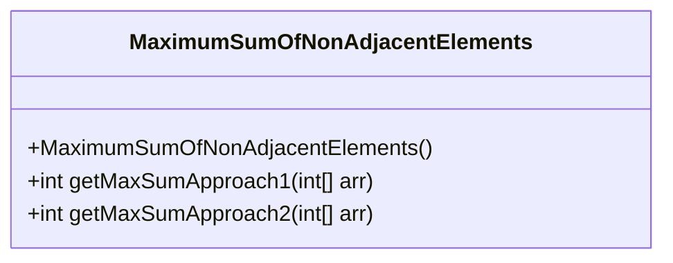
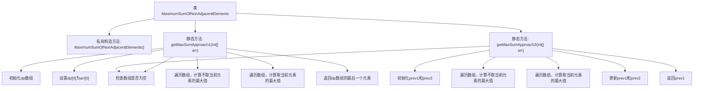

# 基础信息

|      |      |
|------|------|
| 名称 | MaximumSumOfNonAdjacentElements |
| 编码语言 | .java |
| 代码路径 | Java/src/main/java/com/thealgorithms/dynamicprogramming/MaximumSumOfNonAdjacentElements.java |
| 包名 | com.thealgorithms.dynamicprogramming |
| 依赖项 | [] |
| 概述说明 | 动态规划求解非相邻元素最大和，使用数组存储或变量优化两种方法。 |

# 说明

动态规划用于求解非相邻元素的最大和问题，提供了两种实现方法。第一种方法使用数组存储中间结果，通过遍历元素并计算每一步的最大和，最终得到全局最优解。第二种方法采用变量优化，利用有限数量的变量代替数组，减少空间复杂度，同时保持相同的时间复杂度。两种方法都能有效解决问题，选择取决于具体场景和对空间复杂度的要求。

# 类列表 Class Summary

| 名称   | 类型  | 说明 |
|-------|------|-------------|
| MaximumSumOfNonAdjacentElements | class | 动态规划求解非相邻元素最大和，两种方法：数组存储和变量优化。 |

## 类 MaximumSumOfNonAdjacentElements

|      |      |
|------|------|
| 访问范围 | final |
| 类型 | class |
| 名称 | MaximumSumOfNonAdjacentElements |
| 说明 | 动态规划求解非相邻元素最大和，两种方法：数组存储和变量优化。 |

### UML类图

**描述：**  
`MaximumSumOfNonAdjacentElements` 是一个工具类，提供了两种方法来计算数组中非相邻元素的最大和。第一种方法 `getMaxSumApproach1` 使用动态规划数组存储每个索引的最大和，时间复杂度为 O(n)，空间复杂度为 O(n)。第二种方法 `getMaxSumApproach2` 优化了空间复杂度，仅使用两个变量来存储前两个结果，时间复杂度仍为 O(n)，但空间复杂度降低到 O(1)。该类为工具类，无法实例化，所有方法均为静态方法。

### 内部方法调用关系图

这段代码定义了一个名为`MaximumSumOfNonAdjacentElements`的类，其中包含两个静态方法`getMaxSumApproach1`和`getMaxSumApproach2`，用于计算数组中不相邻元素的最大和。`getMaxSumApproach1`使用动态规划数组来存储每个索引处的最大和，而`getMaxSumApproach2`则优化了空间复杂度，仅使用两个变量来存储前两个结果。流程图展示了这两个方法的执行流程，包括初始化、遍历数组、计算最大值以及返回结果等步骤。

### 字段列表 Field List

| 名称  | 类型  | 说明 |
|-------|-------|------|

### 方法列表 Method List

| 名称  | 类型  | 说明 |
|-------|-------|------|
| getMaxSumApproach2 | int | 计算数组中不相邻元素的最大和。 |
| getMaxSumApproach1 | int | 方法getMaxSumApproach1计算数组最大子序列和，使用动态规划，返回结果。 |

