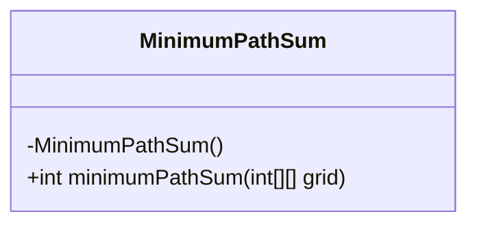
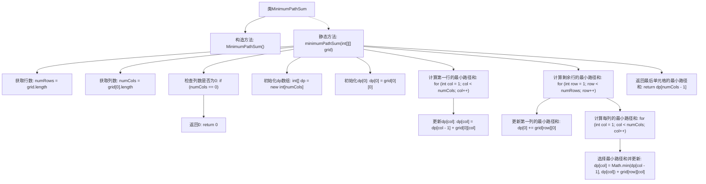

# 基础信息

|      |      |
|------|------|
| 名称 | MinimumPathSum |
| 编码语言 | .java |
| 代码路径 | Java/src/main/java/com/thealgorithms/dynamicprogramming/MinimumPathSum.java |
| 包名 | com.thealgorithms.dynamicprogramming |
| 依赖项 | [] |
| 概述说明 | 计算二维网格左上到右下的最小路径和。 |

# 说明

该问题要求计算在一个二维网格中，从左上角到右下角的最小路径和。具体来说，网格中的每个单元格包含一个数值，路径只能向右或向下移动。目标是找到一条路径，使得路径上所有单元格的数值之和最小。这个问题通常通过动态规划方法来解决，通过逐步计算每个单元格的最小路径和，最终得到从起点到终点的最小路径和。

# 类列表 Class Summary

| 名称   | 类型  | 说明 |
|-------|------|-------------|
| MinimumPathSum | class | 计算二维网格中从左上到右下的最小路径和。 |

## 类 MinimumPathSum

|      |      |
|------|------|
| 访问范围 | public final |
| 类型 | class |
| 名称 | MinimumPathSum |
| 说明 | 计算二维网格中从左上到右下的最小路径和。 |

### UML类图

**描述：**  
`MinimumPathSum` 是一个工具类，用于计算二维网格中从左上角到右下角的最小路径和。它使用动态规划（DP）来优化计算过程，通过初始化一个一维数组 `dp` 来存储每一行的最小路径和，并逐步更新该数组，最终返回右下角的最小路径和。该类是 `final` 的，且构造函数是私有的，确保它不能被实例化或继承。

### 内部方法调用关系图

这段代码实现了一个计算二维网格中从左上角到右下角的最小路径和的算法。首先，代码获取网格的行数和列数，并检查列数是否为0。接着，初始化一个dp数组用于存储每列的最小路径和。然后，分别计算第一行和剩余行的最小路径和，最终返回右下角单元格的最小路径和。

### 字段列表 Field List

| 名称  | 类型  | 说明 |
|-------|-------|------|

### 方法列表 Method List

| 名称  | 类型  | 说明 |
|-------|-------|------|
| minimumPathSum | int | 计算二维网格从左上到右下的最小路径和。 |

