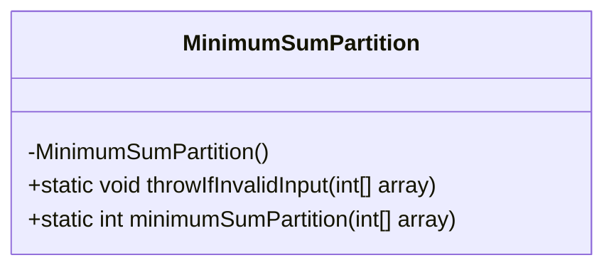
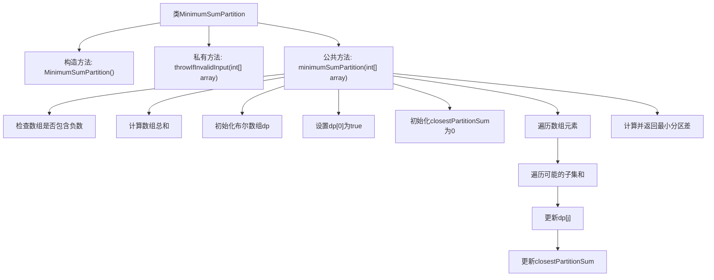

# 基础信息

|      |      |
|------|------|
| 名称 | MinimumSumPartition |
| 编码语言 | .java |
| 代码路径 | Java/src/main/java/com/thealgorithms/dynamicprogramming/MinimumSumPartition.java |
| 包名 | com.thealgorithms.dynamicprogramming |
| 依赖项 | ['java.util.Arrays'] |
| 概述说明 | MinimumSumPartition类通过动态规划计算数组最小分区和差，要求输入无负数。 |

# 说明

MinimumSumPartition类用于计算给定数组的最小分区和差，要求输入数组中的元素均为非负数。该算法采用动态规划方法，通过构建状态转移方程来逐步求解问题，最终找到将数组分为两个子集时，两个子集和的最小差值。这种方法确保了计算的高效性和准确性，适用于处理此类优化问题。

# 类列表 Class Summary

| 名称   | 类型  | 说明 |
|-------|------|-------------|
| MinimumSumPartition | class | MinimumSumPartition类计算数组最小分区和差，确保输入无负数，使用动态规划求解。 |

## 类 MinimumSumPartition

|      |      |
|------|------|
| 访问范围 | public final |
| 类型 | class |
| 名称 | MinimumSumPartition |
| 说明 | MinimumSumPartition类计算数组最小分区和差，确保输入无负数，使用动态规划求解。 |

### UML类图

**描述：**  
`MinimumSumPartition` 类是一个工具类，用于计算给定非负整数数组的最小和分割问题。它包含一个私有构造函数以防止实例化，一个私有静态方法 `throwIfInvalidInput` 用于验证输入数组是否包含负数，以及一个公有静态方法 `minimumSumPartition` 用于计算数组的最小和分割。该方法通过动态规划算法找到最接近数组总和一半的子集和，最终返回两个子集和的差值。

### 内部方法调用关系图

这段代码定义了一个名为 `MinimumSumPartition` 的类，用于计算将一个数组分成两个子集后，两个子集和的最小差值。代码首先检查输入数组是否包含负数，然后计算数组的总和。接着，通过动态规划的方法，找到一个子集的和尽可能接近总和的一半。最后，返回两个子集和的最小差值。

### 字段列表 Field List

| 名称  | 类型  | 说明 |
|-------|-------|------|

### 方法列表 Method List

| 名称  | 类型  | 说明 |
|-------|-------|------|
| throwIfInvalidInput | void | 检查数组元素，若含负数则抛出异常。 |
| minimumSumPartition | int | 计算数组最小分区和差值的动态规划方法。 |

