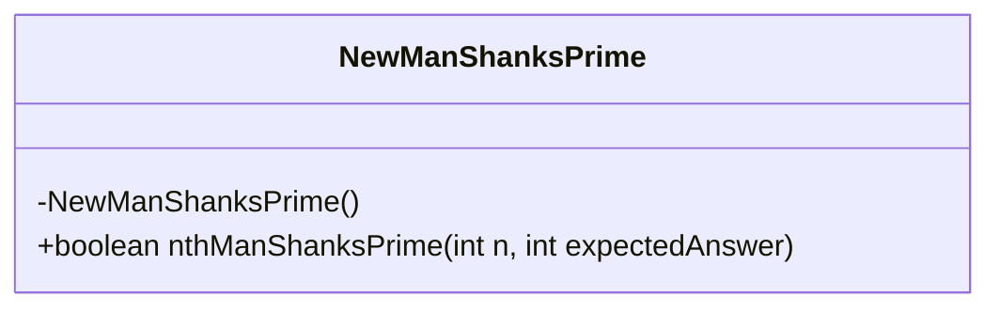
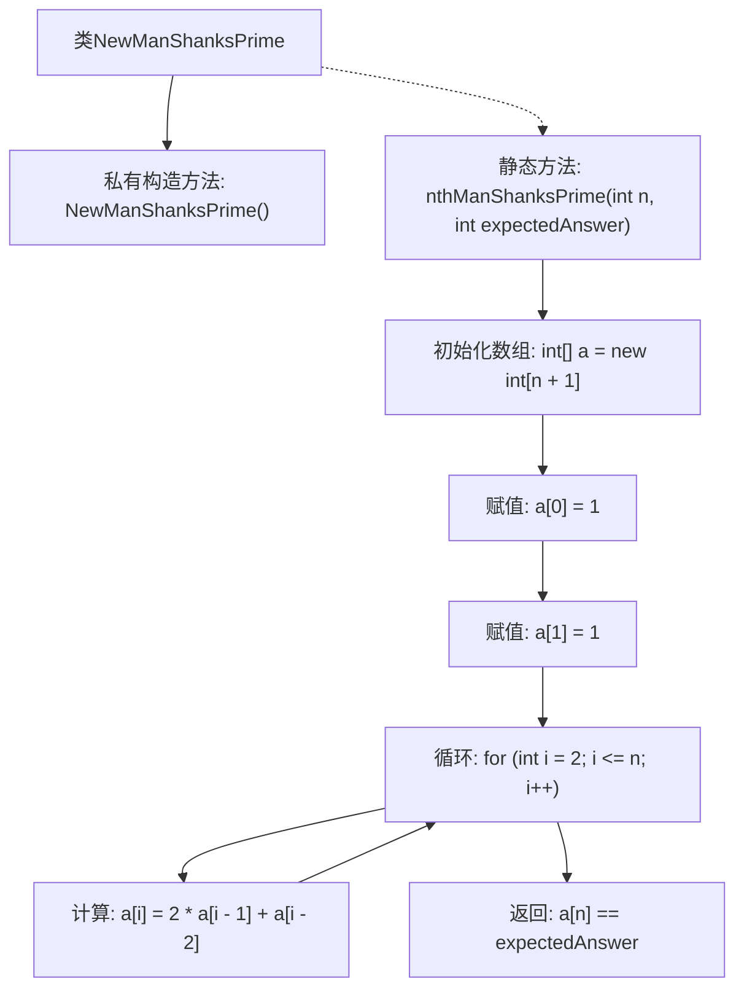

# 基础信息

|      |      |
|------|------|
| 名称 | NewManShanksPrime |
| 编码语言 | .java |
| 代码路径 | Java/src/main/java/com/thealgorithms/dynamicprogramming/NewManShanksPrime.java |
| 包名 | com.thealgorithms.dynamicprogramming |
| 依赖项 | [] |
| 概述说明 | 计算并验证第n个New Man Shanks素数是否符合预期值。 |

# 说明

该任务要求计算第n个New Man Shanks素数，并验证其是否与预期值一致。New Man Shanks素数是一种特殊的素数，其计算过程涉及特定的数学算法和验证步骤。任务的核心在于准确执行计算，确保结果与预先设定的预期值相符，从而验证计算的正确性和可靠性。

# 类列表 Class Summary

| 名称   | 类型  | 说明 |
|-------|------|-------------|
| NewManShanksPrime | class | 计算第n个New Man Shanks素数并验证是否与预期值匹配。 |

## 类 NewManShanksPrime

|      |      |
|------|------|
| 访问范围 | public final |
| 类型 | class |
| 名称 | NewManShanksPrime |
| 说明 | 计算第n个New Man Shanks素数并验证是否与预期值匹配。 |

### UML类图

这段代码定义了一个名为 `NewManShanksPrime` 的类，该类包含一个私有的构造函数和一个公有的静态方法 `nthManShanksPrime`。`nthManShanksPrime` 方法用于计算第 n 个 New Man Shanks 素数，并检查其是否与预期的答案匹配。该方法通过一个数组 `a` 来存储计算过程中的中间结果，并使用递推公式 `a[i] = 2 * a[i - 1] + a[i - 2]` 来计算第 n 个素数。最终，该方法返回一个布尔值，表示计算得到的素数是否与预期的答案一致。

### 内部方法调用关系图

这段代码定义了一个名为 `NewManShanksPrime` 的类，其中包含一个私有构造方法和一个静态方法 `nthManShanksPrime`。该方法计算第 n 个 New Man Shanks 素数，并与预期的答案进行比较。通过初始化数组、赋值、循环计算，最终返回比较结果。流程图展示了从类定义到方法执行的完整流程。

### 字段列表 Field List

| 名称  | 类型  | 说明 |
|-------|-------|------|

### 方法列表 Method List

| 名称  | 类型  | 说明 |
|-------|-------|------|
| nthManShanksPrime | boolean | 方法计算第n个ManShanks素数并验证是否与预期值一致。 |

