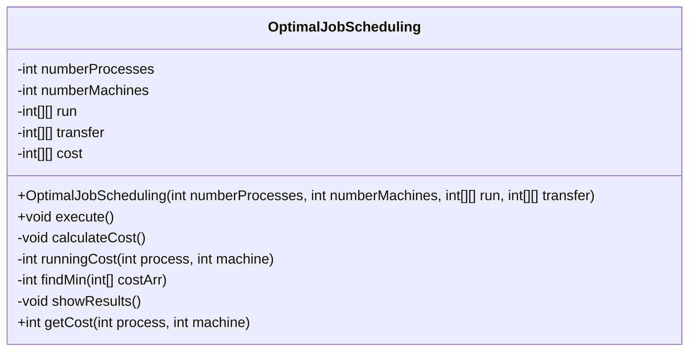
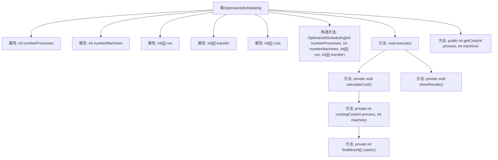

# 基础信息

|      |      |
|------|------|
| 名称 | OptimalJobScheduling |
| 编码语言 | .java |
| 代码路径 | Java/src/main/java/com/thealgorithms/dynamicprogramming/OptimalJobScheduling.java |
| 包名 | com.thealgorithms.dynamicprogramming |
| 依赖项 | [] |
| 概述说明 | OptimalJobScheduling类计算多进程在多机器上的最优调度成本。 |

# 说明

OptimalJobScheduling类的主要功能是计算多进程在多机器上的最优调度成本。该类通过分析和优化进程在多个机器上的分配，旨在找到一种调度方案，使得整体调度成本达到最小。这涉及到对进程和机器的资源需求、处理能力以及调度策略的综合考量，以确保系统资源的高效利用和任务执行的及时完成。

# 类列表 Class Summary

| 名称   | 类型  | 说明 |
|-------|------|-------------|
| OptimalJobScheduling | class | OptimalJobScheduling类用于计算多进程在多机器上的最优调度成本。 |

## 类 OptimalJobScheduling

|      |      |
|------|------|
| 访问范围 | public |
| 类型 | class |
| 名称 | OptimalJobScheduling |
| 说明 | OptimalJobScheduling类用于计算多进程在多机器上的最优调度成本。 |

### UML类图

### 描述
`OptimalJobScheduling` 类用于计算和展示在多个机器上调度多个进程的最小成本。它通过构造函数初始化进程数、机器数、运行成本和传输成本矩阵。`execute` 方法调用 `calculateCost` 来计算每个进程在每台机器上的运行成本，并调用 `showResults` 展示结果。`runningCost` 方法计算特定进程在特定机器上的最小运行成本，`findMin` 方法用于找到数组中的最小值。该类还提供了 `getCost` 方法以获取特定进程在特定机器上的运行成本。

### 内部方法调用关系图

**描述：**  
`OptimalJobScheduling`类用于计算和展示多个进程在多个机器上的最优调度成本。类中包含构造方法、执行方法`execute()`、计算成本方法`calculateCost()`、计算运行成本方法`runningCost()`、查找最小值方法`findMin()`、展示结果方法`showResults()`以及获取成本方法`getCost()`。通过这些方法，类能够计算每个进程在每台机器上的运行成本，并展示最终的成本矩阵。

### 字段列表 Field List

| 名称  | 类型  | 说明 |
|-------|-------|------|
| numberProcesses | int | 私有整型变量numberProcesses |
| run | int[][] | 私有二维整型数组run。 |
| cost | int[][] | 声明一个私有的二维整型数组cost。 |
| transfer | int[][] | 定义私有二维整型数组transfer。 |
| numberMachines | int | 私有整型变量numberMachines，用于存储机器数量。 |

### 方法列表 Method List

| 名称  | 类型  | 说明 |
|-------|-------|------|
| getCost | int | 获取指定工序和机器的成本值。 |
| execute | void | 执行方法包含计算成本和显示结果两个步骤。 |
| calculateCost | void | 计算每个进程在每台机器上的运行成本。 |
| showResults | void | 私有方法显示结果，遍历进程和机器，输出成本矩阵并换行。 |
| runningCost | int | 计算进程在机器上的运行成本，若为第一个进程则直接返回成本，否则计算并返回最小运行成本。 |
| findMin | int | 该方法返回整数数组中的最小值。 |

