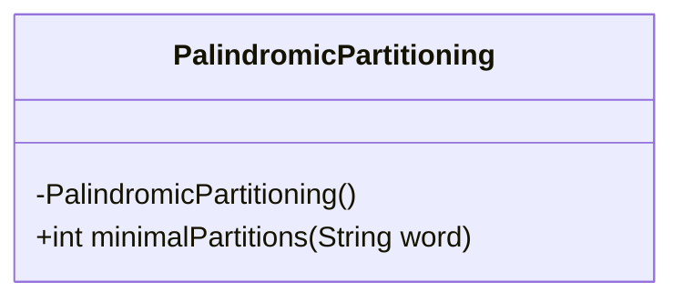
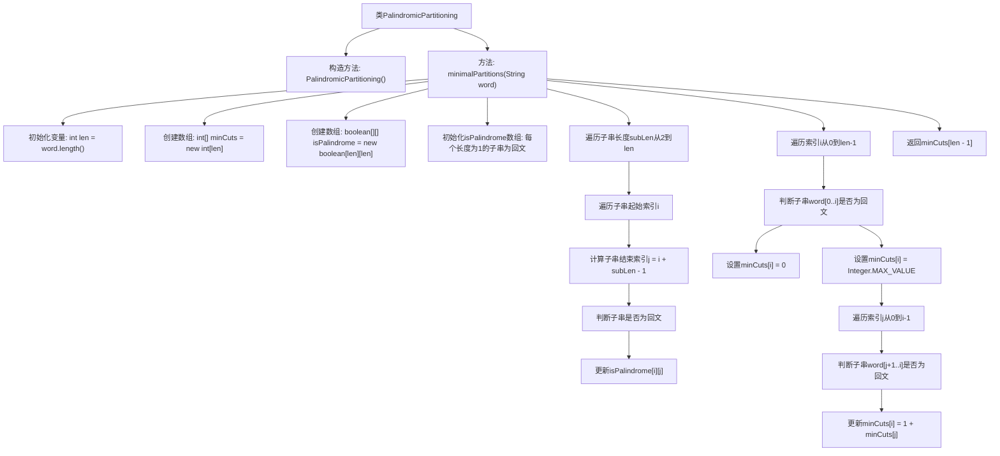

# 基础信息

|      |      |
|------|------|
| 名称 | PalindromicPartitioning |
| 编码语言 | .java |
| 代码路径 | Java/src/main/java/com/thealgorithms/dynamicprogramming/PalindromicPartitioning.java |
| 包名 | com.thealgorithms.dynamicprogramming |
| 依赖项 | [] |
| 概述说明 | 计算字符串回文分割的最小切割次数。 |

# 说明

计算字符串回文分割的最小切割数是指将一个字符串分割成若干个子串，每个子串都是回文，且切割次数最少。该问题通常通过动态规划算法解决，首先判断字符串中所有可能的回文子串，然后利用这些信息计算最小切割次数。关键在于优化判断回文子串的效率和动态规划的状态转移过程，以确保算法的时间复杂度在可接受范围内。

# 类列表 Class Summary

| 名称   | 类型  | 说明 |
|-------|------|-------------|
| PalindromicPartitioning | class | 计算字符串回文分割的最小切割数。 |

## 类 PalindromicPartitioning

|      |      |
|------|------|
| 访问范围 | public final |
| 类型 | class |
| 名称 | PalindromicPartitioning |
| 说明 | 计算字符串回文分割的最小切割数。 |

### UML类图

**描述：**
`PalindromicPartitioning` 类包含一个私有构造函数和一个公有静态方法 `minimalPartitions`。该方法接收一个字符串 `word`，通过动态规划的方法计算将该字符串分割为回文子串所需的最小切割次数。类图中展示了类的结构，其中构造函数是私有的，防止外部实例化，而 `minimalPartitions` 方法是公有的，用于执行核心逻辑。

### 内部方法调用关系图

**描述：**  
该代码实现了一个用于计算字符串最小回文分割次数的算法。通过动态规划，代码首先初始化两个数组`minCuts`和`isPalindrome`，分别用于存储最小分割次数和判断子串是否为回文。然后，代码遍历所有可能的子串长度和起始索引，判断每个子串是否为回文，并更新`isPalindrome`数组。接着，代码计算每个索引位置的最小分割次数，最终返回整个字符串的最小分割次数。该算法通过自底向上的方式，逐步构建解决方案，确保结果的准确性。

### 字段列表 Field List

| 名称  | 类型  | 说明 |
|-------|-------|------|

### 方法列表 Method List

| 名称  | 类型  | 说明 |
|-------|-------|------|
| minimalPartitions | int | 动态规划算法计算字符串最小回文分割次数。 |

