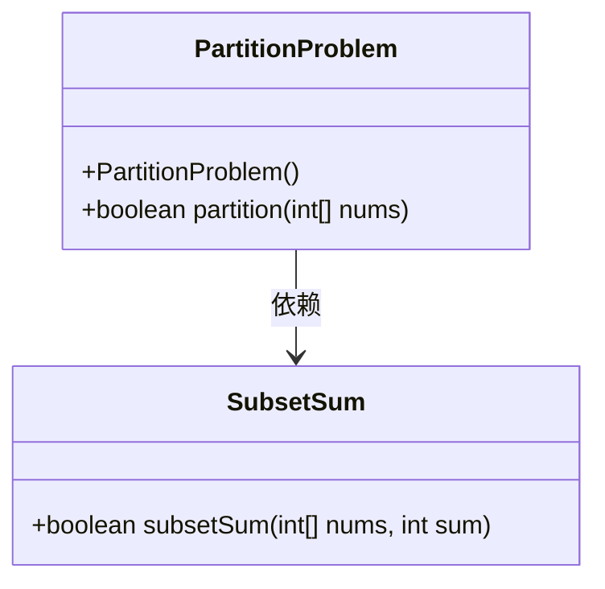
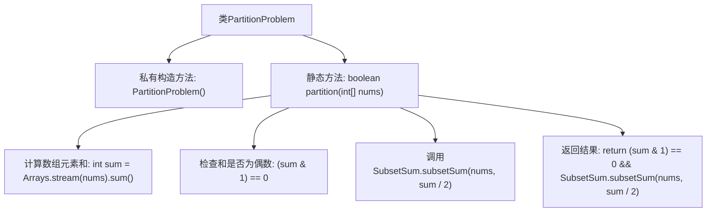

# 基础信息

|      |      |
|------|------|
| 名称 | PartitionProblem |
| 编码语言 | .java |
| 代码路径 | Java/src/main/java/com/thealgorithms/dynamicprogramming/PartitionProblem.java |
| 包名 | com.thealgorithms.dynamicprogramming |
| 依赖项 | ['java.util.Arrays'] |
| 概述说明 | PartitionProblem类用于判断整数数组能否分成两个和相等的子集。 |

# 说明

PartitionProblem类用于判断一个整数数组是否能够被划分为两个和相等的子集。该问题通过检查数组元素的总和是否为偶数来确定是否有可能进行划分。如果总和为偶数，则进一步通过动态规划或其他算法来验证是否存在满足条件的子集划分。如果总和为奇数，则直接判定无法划分。该类的核心目标是确定是否存在一种分割方式，使得两个子集的元素之和相等。

# 类列表 Class Summary

| 名称   | 类型  | 说明 |
|-------|------|-------------|
| PartitionProblem | class | PartitionProblem类判断整数数组是否能被划分为两个和相等的子集。 |

## 类 PartitionProblem

|      |      |
|------|------|
| 访问范围 | public final |
| 类型 | class |
| 名称 | PartitionProblem |
| 说明 | PartitionProblem类判断整数数组是否能被划分为两个和相等的子集。 |

### UML类图

**描述：**
`PartitionProblem` 类用于判断一个整数数组是否可以被分割成两个子集，使得这两个子集的元素和相等。该类通过调用 `SubsetSum` 类的 `subsetSum` 方法来实现这一功能。`PartitionProblem` 类的 `partition` 方法首先计算数组的总和，如果总和为偶数，则进一步检查是否存在一个子集，其元素和等于总和的一半。如果满足条件，则返回 `true`，否则返回 `false`。

### 内部方法调用关系图

这段代码定义了一个名为 `PartitionProblem` 的类，其中包含一个静态方法 `partition`，用于判断一个整数数组是否可以被分割成两个子集，且这两个子集的元素和相等。代码首先计算数组的总和，然后检查总和是否为偶数，如果是偶数，则调用 `SubsetSum.subsetSum` 方法来检查是否存在一个子集的和等于总和的一半。如果满足条件，则返回 `true`，否则返回 `false`。流程图展示了代码的执行流程和各个步骤之间的调用关系。

### 字段列表 Field List

| 名称  | 类型  | 说明 |
|-------|-------|------|

### 方法列表 Method List

| 名称  | 类型  | 说明 |
|-------|-------|------|
| partition | boolean | 检查数组是否能被分为两个和相等的子集。 |

